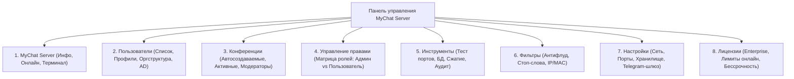

## For future agent
Настоящий документ представляет собой детальный архитектурно-функциональный разбор официальной документации MyChat Server (на основе официального портала справки https://nsoft-s.com/mcserverhelp/about.html). Заметка структурирует каждую вкладку панели управления сервером, ее внутренние процессы, назначение и проекцию на архитектуру OpenMyChat для АО «Страховая компания «Сентрас Иншуранс».

---

## 1. Концепция Self-Hosted / On-Premise мессенджера

MyChat — это защищенная корпоративная коммуникационная платформа класса On-Premise (размещаемая на собственных серверах компании). В отличие от облачных сервисов (Telegram, Slack, MS Teams):
- Все данные (база сообщений SQLite WAL, передаваемые файлы, реестры аудита приказов) хранятся исключительно в контуре защищенной локальной сети компании.
- Гарантируется полное соответствие требованиям регуляторов Республики Казахстан (АРРФР, Национальный Банк РК) и Закону РК «О персональных данных и их защите».
- Платформа стабильно работает в изолированных корпоративных подсетях без прямого доступа в интернет, через межсетевые экраны, NAT и прокси-серверы.

---

## 2. Структура вкладок и процессов консоли управления MyChat Server

### Вкладка 1: MyChat Server (`info.html`)
- **Основная информация (`serverinfomain.html`)**: версия сборки, время непрерывной работы (аптайм), статус системной службы Windows/Linux, текущая нагрузка на процессор и оперативную память.
- **Сетевой статус и Сервисы (`serverinfoservices.html`)**: мониторинг сетевого порта 2004 TCP, веб-сервера администрирования, WebSocket-шлюза и WebRTC сигнального сервера.
- **Онлайн пользователи (`infoonlineusers.html`)**: детальный список активных сессий в реальном времени с фиксацией IP-адреса, сетевого имени ПК, типа клиента (Windows Desktop / Web), времени подключения и возможностью принудительного завершения зависшей сессии (`Kill session`).
- **Системный Терминал (`infomychatterminal.html`)**: интерфейс командной строки для администраторов:
  - `ping` — проверка сетевой связности узлов.
  - `reindex privates` — перестроение индексов FTS5 полнотекстового поиска.
  - `remove confs` / `remove privates` — плановое регламентное обслуживание истории.
  - `PushTokens` — диагностика мобильных токенов доставки оповещений.

### Вкладка 2: Пользователи (`usersmanage.html`)
- **Список пользователей (`usermanagement.html`)**:
  - Добавление, редактирование, блокировка и безвозвратное удаление учетных записей.
  - Назначение подразделения, должности, корпоративного email, телефона и внутреннего номера АТС (в.н.).
- **Регламент увольнения сотрудников (`usersfire.html`)**:
  - Блокировка входа уволенного сотрудника с немедленным разрывом всех активных сокетов.
  - Исключение из общего списка контактов и автосоздаваемых конференций при сохранении истории переписки для ретроспективного аудита службы безопасности.
- **Общий список контактов компании (`usercommoncontacslist.html`)**:
  - Централизованное иерархическое дерево отделов и сотрудников (Головной офис, HR, Web-разработка, Андеррайтинг, Бухгалтерия). Автоматически синхронизируется у всех клиентов при подключении.
- **Интеграция с Active Directory (`userimportactivedirectory.html`)**:
  - Синхронизация по протоколу LDAP/LDAPS: автоматический импорт учетных записей, отделов и фотографий из Microsoft Active Directory.

### Вкладка 3: Конференции (`conference.html`)
- **Автосоздаваемые конференции (`conferenceauto.html`)**:
  - Каналы, создаваемые сервером при старте, куда автоматически и обязательно включаются сотрудники определенных подразделений (например, `#Общий`, `#Новости_Компании`, `#ИТ_Поддержка`).
- **Модерация (`usermoderators.html`)**:
  - Назначение ответственных модераторов каналов с правом смены темы, очистки сообщений и временной блокировки нарушителей.

### Вкладка 4: Управление правами и Роли (`grouprightsmanage.html`)
В соответствии с корпоративной моделью разграничения прав доступа выделяются **две фундаментальные роли**:
1. **Роль «Администратор» (Суперадминистратор, `role_id: 1`)**:
   - **Доступно ВСЁ**:
     - Полный доступ к консоли управления сервером MyChat.
     - Создание, изменение, блокировка и удаление любых пользователей.
     - Управление структурой подразделений и назначение ролей.
     - Доступ к базе данных SQLite и инструментам прямого аудита (DB Studio).
     - Публикация обязательных корпоративных распоряжений (`AnnouncementsView`).
     - Настройка серверных портов, сетевых фильтров и Telegram-шлюза.
2. **Роль «Пользователь» (Сотрудник компании, `role_id: 2`)**:
   - **Доступен ТОЛЬКО СВОЙ КОНТУР**:
     - Сотрудник может менять **только себя**: редактировать свой профиль (ФИО, аватар, телефон, email, статус) через `UserProfileModal`.
     - **Категорически запрещено менять других**: сотрудник не может редактировать чужие профили, не может удалять или блокировать других пользователей.
     - Заблокирован доступ к консоли администрирования (`AdminUserModal`) и Базе данных (`DatabaseStudioView`) — бэкенд возвращает `403 Forbidden`, пункты в меню скрыты.
     - В оповещениях доступен только режим прочтения и электронного подтверждения ознакомления.

### Вкладка 5: Инструменты (`tools.html`)
- **Тестирование портов (`toolstestmychatports.html`)**: проверка доступности порта 2004 TCP из внутренней и внешней сети, диагностика TLS/SSL сертификатов.
- **Обслуживание базы данных (`toolsdatabase.html`)**: оптимизация SQLite (команда `VACUUM`), дефрагментация таблиц, ротация лог-файлов и создание резервных копий (`mychat_backup_*.db`).

### Вкладка 6: Фильтры (`filters.html`)
- **Антифлуд (`filtersantiflood.html`)**: ограничение частоты отправки сообщений (защита от спам-скриптов).
- **Нецензурная лексика (`filtersbadwords.html`)**: автоматическая цензура запрещенных выражений.
- **Черные списки сетевых адресов**: фильтрация нежелательных IP и MAC-адресов.

### Вкладка 7: Настройки (`settings.html`)
- Общие реквизиты: наименование компании, таймаут неактивности сессии для автоматического перевода в статус «Отошел» (300 сек), лимиты вложений.
- Интеграция со шлюзом Telegram (токен бота, ID сервисного канала, маскирование ИИН).

### Вкладка 8: Лицензии (`licenses.html`)
- Информация о корпоративной лицензии: неограниченное число рабочих мест в локальной сети, бессрочный период действия.

---

## 3. Связь с архитектурой OpenMyChat

Настоящий регламент является основой для последующего расширения функциональности OpenMyChat:
- [[Architecture/Architecture - Overview]]
- [[Architecture/Architecture - Database]]
- [[Architecture/Architecture - Server Deployment and Connection]]
- [[Architecture/Architecture - Telegram Integration Guide]]
- [[Architecture/Architecture - Key decisions]]
