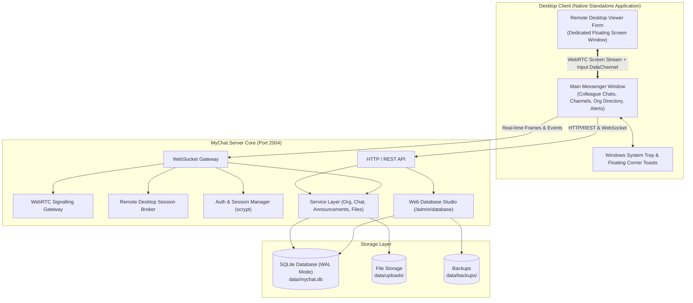

## For future agent
This note provides the top-level architecture overview of OpenMyChat as of 2026-09-07 following the pure production optimization. The system is streamlined strictly as an enterprise corporate colleague chat with zero demo data, fully packaged Windows NSIS/portable executables via `electron-builder`, SQLite WAL persistence, company org tree, broadcast alerts, and WebRTC peer assistance.

## System Overview
OpenMyChat is organized into three primary tiers:
1. **Server Core (`server/`)**: Built on Node.js 24 LTS, hosting the WebSocket real-time gateway on port 2004, REST API endpoints, WebRTC signalling, Remote Desktop session broker, and Web Database Studio.
2. **Database Engine (`data/mychat.db`)**: Native embedded SQLite operated in WAL mode with foreign keys enabled and FTS5 full-text indexing, initialized via clean production bootstrap with zero mock data.
3. **Desktop Application (`desktop/`)**: Standalone packaged Windows desktop application (NSIS installer & portable single-file binary) with custom chrome, system tray integration, unread counters, corner toast alerts, and direct **Remote Desktop Plugin** for peer screen assistance.

## Personas
- **System Administrator (confidence: stated)**: Deploys server as Windows Service, configures firewall (port 2004), manages company departments, user roles, backups in Database Studio, and provides remote screen support.
- **Corporate Executive / Team Lead (confidence: stated)**: Sends official company announcements requiring mandatory confirmation with audit receipts, manages departmental channels.
- **Corporate Colleague / Employee (confidence: stated)**: Engages in 1-on-1 direct messaging, participates in department channels (`#Общий`, etc.), searches company telephone directory, shares files, and initiates P2P WebRTC calls.

## Architecture & Data Flow Diagram

## Network Ports & Topology
| Port | Protocol | Purpose | Access Control |
|---|---|---|---|
| **2004** | TCP / HTTP & WebSocket | Core Server Gateway (API, Realtime Chat, Web Client, Admin Console) | LAN / VPN / WAN |
| **Dynamic (WebRTC)** | UDP | Direct peer-to-peer audio/video and remote desktop stream transmission | LAN / Direct P2P |

## Modules
- [[Architecture - Database]]: Native `node:sqlite` WAL configuration, relational schema, FTS5 search, Web Database Studio.
- [[Architecture - Remote Desktop]]: Dedicated remote desktop assistance plugin, viewer window, host agent, input interception.
- [[Architecture - Realtime and WebRTC]]: WebSocket event protocol, delivery/read receipts, presence heartbeats, WebRTC signalling.
- [[Architecture - Key decisions]]: Architectural decision records (ADRs) explaining technical trade-offs.
