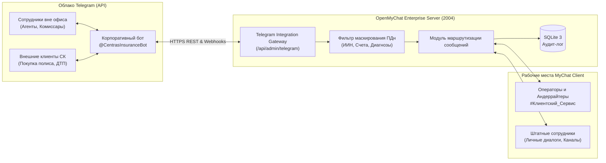

## For future agent
Настоящий документ регламентирует варианты интеграции платформы OpenMyChat Enterprise с мессенджером Telegram для сотрудников и внешних клиентов АО «Страховая компания «Сентрас Иншуранс», включая требования информационной безопасности и комплаенса Республики Казахстан (АРРФР / НБ РК).

---

## 1. Сценарии интеграции с Telegram

Для страховой компании разработаны и предусмотрены 3 ключевых функциональных трека интеграции:

---

## 2. Детальный разбор вариантов работы

### Вариант 1: Шлюз оффлайн-уведомлений сотрудникам (Employee Alerting Gateway)
- **Целевая аудитория**: Штатные сотрудники офиса, менеджеры и руководство.
- **Принцип работы**:
  1. Если адресату отправлено личное сообщение или создано срочное оповещение (Announcement), сервер проверяет статус адресата.
  2. Если пользователь имеет статус `offline` или `away` более 10 минут, сервер генерирует пуш через Telegram Bot:
     > 💬 **Новое сообщение в MyChat**  
     > **От**: Тамерлан Ахметов (Департамент ИТ)  
     > **Текст**: «Согласование регламента завершено, ждем вашей подписи...»  
     > 🔗 *[Открыть MyChat на ПК]*
  3. Привязка профиля сотрудника к Telegram осуществляется через ввод кода или deep-link: `t.me/CentrasInsuranceBot?start=bind_<UIN>_<TOKEN>`.

### Вариант 2: Двусторонний Telegram-мост (Two-Way Conversational Bridge)
- **Целевая аудитория**: Сотрудники на выезде (аварийные комиссары на месте ДТП, страховые агенты, оценщики имущества).
- **Принцип работы**:
  1. Выездной сотрудник получает сообщение из MyChat в Telegram.
  2. Сотрудник нажимает **«Ответить» (Reply)** в Telegram и отправляет текстовый ответ, фото повреждений автомобиля или геолокацию.
  3. Бот пересылает полезную нагрузку на сервер OpenMyChat, который публикует её в соответствующий диалог или канал с пометкой: `[Отправлено из Telegram]`.

### Вариант 3: Канал клиентской техподдержки и консультаций (HelpDesk Gateway)
- **Целевая аудитория**: Клиенты СК «Сентрас Иншуранс» (физические и юридические лица).
- **Принцип работы**:
  1. Клиент пишет в публичный Telegram-бот компании по вопросам оформления ОГПО ВТС, КАСКО или подачи документов по страховому случаю.
  2. Обращение автоматически направляется в выделенный корпоративный канал MyChat: `#Клиентский_Сервис` или `#Урегулирование_Убытков`.
  3. Любой свободный специалист клиентского сервиса отвечает прямо из своего интерфейса MyChat на компьютере.
  4. Ответ прозрачно доставляется клиенту в его диалог с ботом.

---

## 3. Требования информационной безопасности и Комплаенс (РК / АРРФР)

Поскольку Telegram является публичным зарубежным облачным сервисом, при интеграции соблюдаются жесткие нормы законодательства Республики Казахстан:

1. **Закон РК «О персональных данных и их защите»**:
   - Запрещена передача в открытый канал Telegram полных номеров ИИН (12 цифр), номеров удостоверений личности и банковских реквизитов (IBAN).
   - В ядре сервера активирован флаг `telegram_mask_pii: true`, автоматически маскирующий данные: `ИИН: 920514******`, `Счет: KZ24************9012`.
2. **Страховая тайна**:
   - При необходимости администратор может включить режим **«Безопасных уведомлений»**, когда в Telegram отправляется только факт наличия сообщения без цитирования текста: `«Вам поступило новое защищенное сообщение от [ФИО] в корпоративной сети MyChat»`.
3. **Журналирование и Аудит**:
   - Каждый входящий и исходящий пакет шлюза Telegram логируется в локальной таблице аудита SQLite с фиксацией `timestamp`, `telegram_user_id` и статуса доставки.

Связано с:
- [[Architecture/Architecture - Overview]]
- [[Architecture/Architecture - Server Deployment and Connection]]
- [[Architecture/Architecture - Key decisions]]
