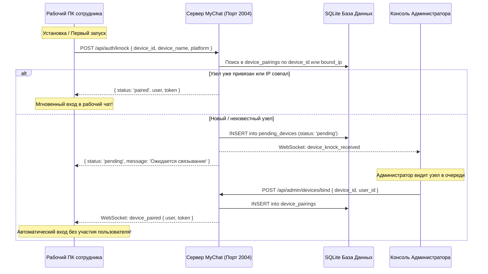
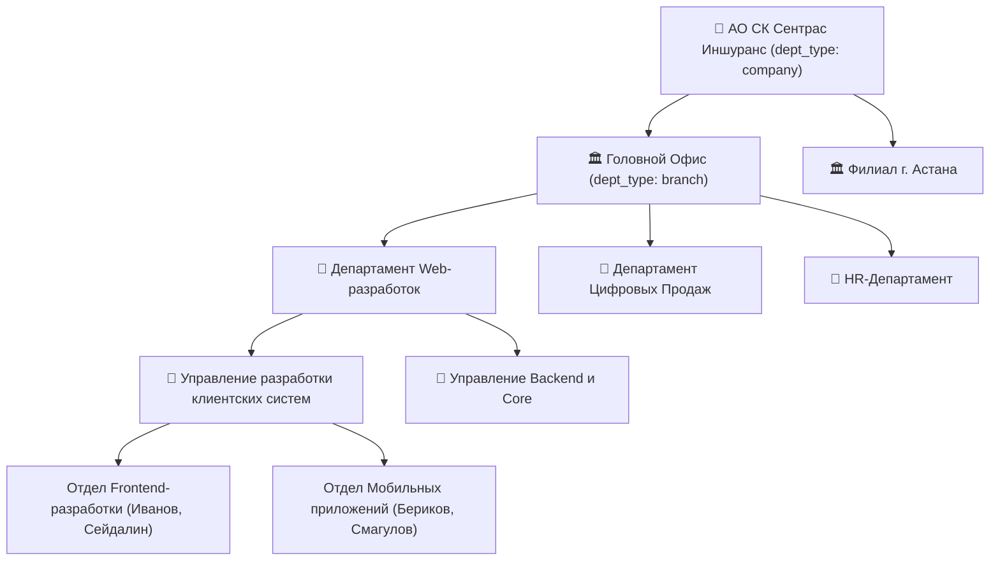

## For future agent
Настоящий документ фиксирует архитектуру подсистемы автоматического подключения устройств по IP (Zero-Touch Provisioning), многоуровневого деления контуров оргструктуры (Компания -> Департамент -> Управление -> Отдел), универсального парсера структуры и сотрудников, делегированного администрирования (Контурные администраторы), а также механизмов нативных Windows-уведомлений, мигания иконки на панели задач и напоминаний о непрочитанных сообщениях.

---

## 1. Концепция подключения по IP без паролей (Zero-Touch Provisioning)

В закрытом корпоративном контуре АО «Страховая компания «Сентрас Иншуранс» реализован регламент бесшовного входа сотрудников:



---

## 2. Многоуровневые Контуры и Иерархия Оргструктуры

Система поддерживает произвольную глубину вложенности подразделений и холдинговых компаний:



- **Рекурсивная агрегация счетчиков**: каждый родительский узел автоматически суммирует показатели всех вложенных подразделений: `[Активные / Всего]` (например, `АО СК Сентрас Иншуранс - 3/15`).
- **Справочник сотрудников**: каскадное раскрытие с поддержкой поиска по ФИО, должности и внутреннему номеру АТС.

---

## 3. Универсальный Парсер и Пакетный Импорт Оргструктуры

В панели управления реализован движок `OrgParserService` с поддержкой трех форматов:
1. **Формат путей со слэшем (/)**:
   ```text
   АО СК Сентрас Иншуранс / Департамент Web-разработок / Отдел Frontend / Сейдалин Мурат | mseidalin | 192.168.10.60 | 2415 | Разработчик React | mseidalin@cic.kz
   ```
2. **Древовидный текст с отступами (Indented text)**:
   ```text
   АО СК Сентрас Иншуранс
     Департамент Web-разработок
       Управление мобильных систем
         Отдел iOS и Android
           Бериков Нурлан (login: nberikov, ip: 192.168.10.80, phone: 2420, job: Mobile Dev)
   ```
3. **Табличный CSV / Excel (разделитель `;` или табуляция)**:
   ```text
   Компания;Департамент;Управление;Отдел;ФИО;Логин;IP;Телефон;Должность;Email
   АО СК Сентрас Иншуранс;Департамент Андеррайтинга;Управление автострахования;Сектор КАСКО;Калиев Даурен;dkaliev;192.168.10.90;2150;Андеррайтер;dkaliev@cic.kz
   ```

Перед сохранением администратор может запустить **Предпросмотр структуры** (`POST /api/admin/org/preview-import`), который выводит дерево будущих отделов и список распознанных сотрудников с их закрепленными IP-адресами.

---

## 4. Делегированное администрирование (Контурные администраторы)

Для крупных структур реализована роль **«Контурный администратор»** (`role_id: 3`):
- Суперадминистратор назначает сотруднику поле `admin_scope_dept_id`.
- При входе в панель управления контурный администратор:
  - Видит баннер: `🛡️ Вы авторизованы как Контурный администратор`.
  - Имеет доступ **строго к своему подразделению и его дочерним подотделам**.
  - Не может просматривать, изменять или удалять сотрудников других департаментов.
  - Ограничен в привязке устройств только к пользователям своего контура.
  - Лишен доступа к глобальным настройкам сервера и DB Studio.

---

## 5. Нативные Уведомления, Мигание и Напоминания

### 5.1. Уведомления поверх окон и звук
- При поступлении сообщения входящий вызов активирует нативное всплывающее уведомление Windows (`Notification`) и плавающее окно в правом нижнем углу экрана (`toast.html`).
- Синтезируется тактильный звуковой сигнал через Web Audio API (`playChimeSound`, частоты 587 Гц -> 880 Гц).

### 5.2. Мигание иконки на панели задач Windows (Taskbar Flashing)
- Если окно не в фокусе, вызывается `mainWindow.flashFrame(true)`.
- При клике на уведомление или фокусировке окна мигание автоматически отключается (`mainWindow.flashFrame(false)`).

### 5.3. Рандомное напоминание о непрочитанных в течение часа
- Если у пользователя есть непрочитанные сообщения (`totalUnread > 0`) и он не переключился в чат:
- Система генерирует случайный таймер в диапазоне 20–50 минут:
  ```javascript
  const randomDelay = Math.floor((20 + Math.random() * 30) * 60 * 1000);
  ```
- При срабатывании таймера выводится напоминание:
  *«🔔 Напоминание о непрочитанных сообщениях: У вас 3 непрочитанных сообщения от коллег (Дильмурат, Тамерлан). Нажмите, чтобы открыть.»*

### 5.4. Отметки в интерфейсе
- Красные круглые бейджи `.dialog-unread-badge` в списке диалогов с пульсирующей микроанимацией.
- Бейджи `.tree-unread-badge` в дереве общих контактов напротив написавших коллег.
- Счетчик в заголовке окна: `(3) Тамерлан Джумагулов — MyChat Enterprise`.
- Счетчик в подсказке трея Windows: `OpenMyChat Enterprise (3 непрочитанных)`.

---

## 6. Best Practices Установщика Windows (NSIS)

Конфигурация `electron-builder` настроена по корпоративным стандартам:
- `oneClick: false` — пользователь видит мастер установки с лицензией и выбором пути.
- `perMachine: false` — установка в пользовательский профиль (`%LOCALAPPDATA%`) без запроса прав администратора UAC (подходит для рабочих мест со строгими политиками домена).
- `createDesktopShortcut: true` и `createStartMenuShortcut: true` — ярлыки в меню «Пуск» и на рабочем столе.
- `runAfterFinish: true` — автоматический запуск клиента после завершения установки.
- `deleteAppDataOnUninstall: false` — сохранение локального кэша и истории при переустановках.
- `app.setAppUserModelId('com.openmychat.desktop')` — регистрация приложения в Центре уведомлений Windows 10/11.

---

## 7. Связанные заметки
- [[Architecture/Architecture - Overview]]
- [[Architecture/Architecture - Database]]
- [[Architecture/Architecture - MyChat Server Reference and Functional Map]]
- [[Architecture/Architecture - Server Deployment and Connection]]
- [[Architecture/Architecture - Telegram Integration Guide]]
