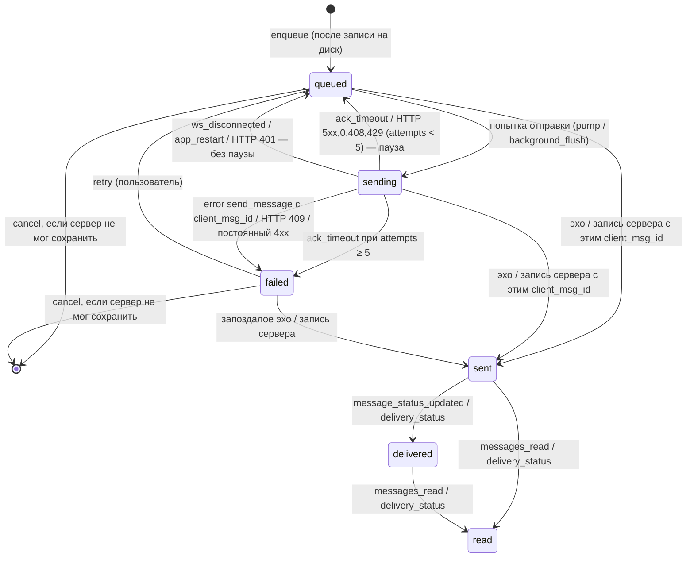

# Состояние доставки сообщений на клиенте (delivery-state)

Единая модель жизни сообщения на клиенте: очередь отправки (outbox), статусы доставки, слияние с `/api/sync`, правила непрочитанного. **Обязательна для iOS и Android**: обе платформы реализуют свой редьюсер по этому документу и обязаны проходить **все** векторы из `fixtures/reducers/` (см. §11).

- Эталон: `reference/delivery-reducer.mjs` — чистая функция без ввода-вывода, исполняемая версия этого документа. При расхождении текста и эталона ошибка ищется в обоих и исправляется вместе с векторами; платформы сверяются с векторами.
- Векторы: `fixtures/reducers/*.json` (формат — `fixtures/reducers/README.md`). Серверный тест `server/test/mobile-delivery-reducer.test.js` прогоняет их через эталон в `cd server && npm test`.
- Опирается на `ws-protocol.md` (§3.2 `client_msg_id`, §4.2 события сообщений, §6.2–6.3 доставка, курсор и алгоритм переподключения) и `openapi.yaml` (`/messages/*`, `/sync`). Этот документ уточняет §6.3 «Алгоритм переподключения клиента» и при расхождении имеет приоритет для клиентского поведения.

---

## 1. Принципы

1. **Редьюсер чистый.** `reduce(state, event) → { state, effects }`. Никаких часов, случайных чисел, сети и диска внутри. Время приходит в событии (`now`, epoch мс), идентификаторы (`client_msg_id`) генерирует платформа и передаёт в событии.
2. **Состояние — простые данные** (JSON): списки, словари, строки, числа, `null`. Платформа хранит его как угодно, но для сверки с векторами проецирует ровно в форму §3.
3. **Побочные действия — список эффектов**, который возвращает редьюсер (§5). Платформа исполняет их строго по порядку.
4. **Истина — сервер.** Любая серверная запись сообщения побеждает локальную догадку; статусы только повышаются; удаление окончательно.
5. **Повтор безопасен.** Каждое сообщение отправляется с постоянным `client_msg_id`; сервер не создаёт копий (ws-protocol §3.2). Поэтому при любой неизвестности клиент повторяет, а не гадает.

## 2. Термины

- **`me`** — id текущего пользователя (из `auth_success.user.id`).
- **Ключ переписки** (`conversation`) — строка `"direct:<id собеседника>"` или `"channel:<id канала>"`, id — десятичное целое > 0 без ведущих нулей (регулярное выражение `^(direct|channel):[1-9][0-9]*$`).
  - для записи сообщения: канал — `channel:<target_id>`; личное — `direct:<собеседник>`, где собеседник = `target_id`, если `sender_id == me`, иначе `sender_id`.
- **`client_msg_id`** — ключ идемпотентности, см. §7.1.
- **Запись сообщения** — объект сообщения сервера (кадры `new_message`/`direct_message`/`channel_message`/`message_updated`, элементы `/api/sync`, страницы `/api/messages/...`, тело ответа `POST /api/messages/...`).
- **Голова переписки** — первая по `seq` запись outbox этой переписки в состоянии, отличном от `failed`.

## 3. Модель состояния

```jsonc
{
  "me": 2,                          // id пользователя или null до первого auth_success
  "connection": "offline",          // "offline" | "online" (сокет авторизован)
  "visible": null,                  // ключ открытой на экране переписки или null
  "sync": {
    "cursor": null,                 // непрозрачная строка next_cursor или null (нет курсора)
    "running": false,               // идёт цепочка запросов /api/sync
    "bootstrap": false              // текущая цепочка начата без курсора (первый запуск / после 410)
  },
  "seq": 0,                         // последний выданный порядковый номер outbox
  "outbox": [],                     // записи очереди отправки, по возрастанию seq
  "ops": [],                        // отложенные кадры правки/удаления (edit_message/delete_message)
  "messages": {},                   // { ключ переписки: [сообщения по возрастанию id] }
  "unread": {},                     // { ключ переписки: число > 0 }; нулевых ключей нет
  "sendLog": [],                    // now каждой WS-отправки send_message за последнюю секунду
  "wake_at": null                   // время уже запрошенного будильника tick или null
}
```

### 3.1. Запись outbox

Все поля всегда присутствуют.

| Поле | Тип | Смысл |
|---|---|---|
| `client_msg_id` | string | ключ идемпотентности (§7.1); единственный идентификатор записи |
| `conversation` | string | ключ переписки |
| `seq` | int | порядок постановки в очередь (`state.seq + 1` при `enqueue` и `retry`) |
| `text` | string | текст |
| `msgType` | `"text"`\|`"file"`\|`"image"` | тип сообщения |
| `reply_to_id` | int\|null | ответ на сообщение |
| `metadata` | object\|null | метаданные (`{ "file_id": 42 }`) |
| `state` | `"queued"`\|`"sending"`\|`"failed"` | состояние записи |
| `attempts` | int | сколько раз кадр/запрос ушёл с текущего бюджета попыток |
| `maybe_stored` | bool | сервер **мог** сохранить сообщение (кадр хоть раз ушёл и не было отказа) |
| `transport` | `"ws"`\|`"http"`\|null | чем отправлено сейчас (только в `sending`) |
| `ack_deadline` | int\|null | до какого `now` ждать подтверждения (только в `sending`) |
| `next_attempt_at` | int\|null | не отправлять раньше (пауза после неудачи) |
| `failure` | object\|null | `{ "reason": "rejected"\|"max_attempts", "code": string\|null, "message": string\|null }` в `failed` |
| `pending_edit` | string\|null | правка, которую применить после подтверждения (§7.10) |
| `pending_delete` | bool | удалить после подтверждения (§7.10) |

### 3.2. Сообщение в `messages`

Проекция записи сервера; платформа может хранить больше полей (имя отправителя, вложение), но для сверки с векторами проецирует ровно в эти поля (все всегда присутствуют):

`id`, `client_msg_id` (string\|null), `sender_id`, `text`, `type`, `reply_to_id`, `metadata_json` (строка\|null), `created_at`, `updated_at` (string\|null), `is_deleted` (`0`\|`1`), `status`.

`status`: у своих сообщений (`sender_id == me`) — `"sent"`\|`"delivered"`\|`"read"`; у чужих — `null`. Статус своего сообщения из записи: в канале всегда `"sent"`; в личной — `delivery_status` (`"delivered"`/`"read"`), иначе `"sent"` (в живых кадрах `delivery_status` нет — это `"sent"`).

### 3.3. Что видит пользователь

Лента переписки = `messages[conv]` (по `id`) и за ними записи outbox этой переписки без `pending_delete` (по `seq`). Отображаемый статус:

| Где | Отображаемое состояние |
|---|---|
| outbox, `state = queued` | **queued** («в очереди», часы) |
| outbox, `state = sending` | **sending** («отправляется») |
| outbox, `state = failed` | **failed** («не отправлено», кнопки «Повторить» / «Удалить») |
| `messages`, `status = sent` | **sent** (одна галочка) |
| `messages`, `status = delivered` | **delivered** (две галочки) |
| `messages`, `status = read` | **read** (две цветные галочки) |

Идентичность строки в UI — `client_msg_id`, если он есть, иначе `id`: при подтверждении (§7.6) пузырь не «прыгает».



## 4. События

Каждое событие — JSON-объект с `type` и `now` (целое, epoch мс; в пределах одного запуска не убывает). Кадры и тела сервера вкладываются **дословно в форме фикстур** (`fixtures/ws/*`, `fixtures/http/*`); неизвестные поля игнорируются.

### 4.1. От сервера

| `type` | Поля | Откуда |
|---|---|---|
| `ws` | `frame` — кадр сервер→клиент как на проводе | каждый входящий WS-кадр. Обрабатываются `auth_success`, `new_message`, `direct_message`, `channel_message`, `message_updated`, `message_deleted`, `message_status_updated`, `messages_read`, `error`; остальные типы не меняют модель доставки |
| `sync_page` | `body` — тело ответа `GET /api/sync` 200 (`http/sync.page.json`) | ответ на эффект `sync_request` |
| `sync_reset_410` | `body` — тело 410 (`http/sync.cursor-invalid.json`) | ответ 410 `SYNC_CURSOR_INVALID` на `sync_request` |
| `sync_failed` | `status` (0 — сеть), `retry_after_ms` (int\|отсутствует; из `Retry-After`) | любой другой неуспех `sync_request` |
| `history_page` | `body` — массив записей (`http/messages.direct-page.json`) | ответ на `load_history` или любую загрузку страницы переписки |
| `http_send_result` | `client_msg_id`, `attempt`, `status` (0 — сеть), `body` (JSON ответа или `null`) | ответ на эффект `send_http` |
| `unread_snapshot` | `counts` — `{ ключ переписки: unread_count }` | из `GET /api/channels` и `GET /api/conversations/direct` после `refresh_conversation_lists` |

### 4.2. Локальные

| `type` | Поля | Когда |
|---|---|---|
| `ws_disconnected` | — | сокет закрыт (любая причина, в т.ч. `server_disconnect`) |
| `enqueue` | `client_msg_id`, `conversation`, `text`, `msgType`? (`"text"`), `reply_to_id`? (`null`), `metadata`? (`null`) | пользователь нажал «Отправить» |
| `edit` | ровно одно из `client_msg_id` (запись outbox) / `message_id` (сообщение сервера), `text` | пользователь сохранил правку |
| `delete` | `message_id` | пользователь удалил отправленное сообщение |
| `cancel` | `client_msg_id` | пользователь удалил/отменил неотправленное (queued/sending/failed) |
| `retry` | `client_msg_id`, `new_client_msg_id` (свежий UUID v4; используется, только если нужен новый ключ) | «Повторить» у `failed` |
| `ack_timeout` | `client_msg_id`, `attempt` | будильник из эффекта `schedule` |
| `tick` | — | будильник из эффекта `schedule` |
| `sync_start` | — | будильник после `sync_failed`, возврат приложения на передний план, push |
| `background_flush` | — | фоновая задача ОС (iOS BGTask / Android WorkManager) без сокета |
| `conversation_opened` | `conversation` | переписка стала видимой на экране |
| `conversation_closed` | — | переписку закрыли, приложение ушло в фон, экран погас |
| `app_restart` | — | первое событие нового процесса над восстановленным с диска состоянием |

> Отдельного события «попытка отправки записана» нет: редьюсер сам переводит запись в `sending` в том же шаге, где выдаёт `send_ws`/`send_http` (§6.2). Эхо, пришедшее к записи в любом состоянии — `queued` (например, во время паузы после таймаута, до следующей попытки), `sending` или `failed`, — подтверждает её (§7.6).

## 5. Эффекты

Исполняются **строго по порядку** выдачи.

| `type` | Поля | Что делает платформа |
|---|---|---|
| `persist` | `slices` — отсортированный подсписок `["cursor","ops","outbox"]` | **барьер**: надёжно записать (транзакция/fsync) эти части **нового** состояния (`outbox` включает `seq`; `cursor` = `sync.cursor`). Следующие эффекты — только после успешной записи. При ошибке записи — **отбросить новое состояние** (остаться на прежнем) и не исполнять остальные эффекты; композер не очищается. Если `persist` есть, он всегда первый |
| `clear_composer` | `conversation` | очистить поле ввода (только после `persist`, §7.4) |
| `send_ws` | `frame` | отправить кадр в сокет как есть (`send_message`, `edit_message`, `delete_message`, `mark_read`). Ошибку записи в сокет не сообщать — придёт `ws_disconnected` / `ack_timeout` |
| `send_http` | `client_msg_id`, `attempt`, `method`, `path`, `body` | выполнить запрос; результат — событием `http_send_result` с теми же `client_msg_id` и `attempt` |
| `schedule` | `at`, `event` | в момент `≥ at` диспетчеризовать `event` (дополнив `now`). Отменять будильники не требуется: устаревшие события безвредны (§6.5); одинаковые можно схлопывать |
| `sync_request` | `cursor` (string\|null), `limit` | `GET /api/sync?since=<cursor>&limit=<limit>` (без `since`, если `null`); результат — `sync_page` / `sync_reset_410` / `sync_failed` |
| `refresh_conversation_lists` | — | `GET /api/channels` и `GET /api/conversations/direct`; счётчики — событием `unread_snapshot` |
| `load_history` | `conversation` | загрузить последнюю страницу переписки (`GET /api/messages/...`); результат — `history_page` |
| `user_error` | `code` | показать ошибку ввода; состояние не изменилось |

Коды `user_error`: `INVALID_CLIENT_MSG_ID`, `INVALID_CONVERSATION`, `INVALID_MESSAGE_TYPE`, `EMPTY_TEXT`, `TEXT_TOO_LONG`, `NOT_EDITABLE`, `NOT_DELETABLE`.

Платформа **может** схлопывать подряд идущие одинаковые `send_ws` с кадром `mark_read` одной переписки в пределах 500 мс (предел сервера — 20 `mark_read`/с) — это свобода исполнителя, а не редьюсера.

## 6. Алгоритм

`reduce(state, event)`:
1. применить обработчик события (§6.3), собрав его эффекты;
2. выполнить **насос** (`pump`, §6.2) — всегда, после любого события;
3. если `sync.cursor`, `ops` или `outbox`/`seq` изменились относительно входного состояния — поставить в начало эффектов `{"type":"persist","slices":[...]}` (только изменившиеся, по алфавиту).

Входное состояние не изменяется (возвращается новое).

### 6.1. Константы

| Имя | Значение | Откуда |
|---|---|---|
| `CLIENT_MSG_ID_RE` | `^[A-Za-z0-9_-]{1,64}$` | сервер, `CLIENT_MSG_ID_RE` |
| `MAX_TEXT_LENGTH` | `16000` (единицы UTF-16, как `String.length` в JS; Swift — `text.utf16.count`) | сервер |
| `ACK_TIMEOUT_MS` | `10000` | ws-protocol §6.3 |
| `HTTP_ACK_TIMEOUT_MS` | `30000` | — |
| `MAX_ATTEMPTS` | `5` | — |
| `backoff(n)` | `min(1000 · 2^(n−1), 30000)` мс после `n`-й неудачной попытки: 1, 2, 4, 8 с | — |
| `SEND_RATE_MAX` / `SEND_RATE_WINDOW_MS` | `8` за `1000` мс | сервер режет 10/с на сокет молча (ws-protocol §2.3); запас 2 |
| `SYNC_PAGE_LIMIT` | `200` | максимум `/api/sync` |
| `SYNC_RETRY_MS` | `5000` (если нет `retry_after_ms`) | — |
| `KEY_ERRORS` | `CLIENT_MSG_ID_CONFLICT`, `INVALID_CLIENT_MSG_ID` | сервер |

Пустой текст: `text.trim() == ""` по набору пробельных символов ECMAScript (`String.prototype.trim`).

### 6.2. Насос (`pump`)

```
pump(state, now):
  если connection != "online" или sync.running: ничего не делать
  если wake_at != null и wake_at <= now: wake_at = null
  sendLog = [t из sendLog, где now − t < SEND_RATE_WINDOW_MS]
  для каждого кадра op из ops по порядку: эффект send_ws{frame: op};  ops = []
  wakeAt = null;  занятые = ∅
  вПолёте = { e.conversation | e ∈ outbox, e.state == "sending" }
  для каждой записи e из outbox по возрастанию seq:
    если e.state == "failed" или e.conversation ∈ занятые: пропустить
    занятые += e.conversation                     // e — голова своей переписки
    если e.state != "queued" или e.conversation ∈ вПолёте: пропустить   // stop-and-wait
    если e.next_attempt_at != null и e.next_attempt_at > now:
      wakeAt = min(wakeAt, e.next_attempt_at); пропустить
    если |sendLog| >= SEND_RATE_MAX:
      wakeAt = min(wakeAt, sendLog[0] + SEND_RATE_WINDOW_MS); пропустить
    отправить(e, "ws"):
      e.state = "sending"; e.transport = "ws"; e.attempts += 1; e.maybe_stored = true
      e.ack_deadline = now + ACK_TIMEOUT_MS; e.next_attempt_at = null; sendLog += now
      эффект send_ws{frame: send_message(e)}
      эффект schedule{at: e.ack_deadline, event: {type:"ack_timeout", client_msg_id, attempt: e.attempts}}
  если wakeAt != null и wakeAt != wake_at: эффект schedule{at: wakeAt, event: {type:"tick"}}
  wake_at = wakeAt
```

Кадр `send_message(e)` (все ключи всегда):
`{"type":"send_message","conversationType":"direct","targetId":3,"text":…,"msgType":…,"replyToId":…,"metadata":…,"client_msg_id":…}`.

`background_flush` (только при `connection == "offline"`; иначе ничего): тот же обход голов (включая `вПолёте`), но без предела частоты и без будильника; подходящая голова (`queued`, `next_attempt_at` нет или `≤ now`) отправляется через HTTP: `transport = "http"`, `ack_deadline = now + HTTP_ACK_TIMEOUT_MS`, эффекты `send_http` и `schedule ack_timeout`:
`{"type":"send_http","client_msg_id":…,"attempt":n,"method":"POST","path":"/api/messages/direct/3","body":{"text":…,"type":…,"reply_to_id":…,"metadata":…,"client_msg_id":…}}` (`/api/messages/channels/<id>` для каналов).

### 6.3. Обработчики

**`ws` + `auth_success`**: `me = frame.user.id`; `connection = "online"`; `sendLog = []`; если `!sync.running` — `sync.running = true`, `sync.bootstrap = (sync.cursor == null)`, эффект `sync_request{cursor, limit: 200}`.

**`ws_disconnected`**: `connection = "offline"`; `sync.running = false`; `sendLog = []`; каждая запись `sending` с `transport == "ws"` → `queued`, `transport/ack_deadline/next_attempt_at = null` (`attempts`, `maybe_stored` сохраняются). HTTP-запросы в полёте не трогаются.

**`enqueue`** — проверки по порядку, первая сработавшая даёт `user_error` без изменений:
1. `client_msg_id` не подходит под `CLIENT_MSG_ID_RE` → `INVALID_CLIENT_MSG_ID`;
2. ключ уже есть в outbox или у своего сообщения в `messages` → **ничего** (повторная диспетчеризация того же нажатия);
3. `conversation` не ключ переписки → `INVALID_CONVERSATION`;
4. `msgType ∉ {text,file,image}` → `INVALID_MESSAGE_TYPE`;
5. `msgType == "text"` и пустой текст → `EMPTY_TEXT`;
6. длина `> MAX_TEXT_LENGTH` → `TEXT_TOO_LONG`.

Иначе `seq += 1` и в outbox добавляется запись `queued` (`attempts 0`, `maybe_stored false`, прочие `null`/`false`); эффект `clear_composer{conversation}`.

**Запись сервера** (`ingest(rec, source)`, `source ∈ live | update | sync | history | http`):
```
conv = ключ(rec); own = rec.sender_id == me; reconciled = false
если own и rec.client_msg_id != null и в outbox есть e с этим client_msg_id:   // §7.6
  удалить e из outbox; reconciled = true
  если rec.is_deleted == 0:
    если e.pending_delete: ops += {type:"delete_message", messageId: rec.id}
    иначе если e.pending_edit != null и e.pending_edit != rec.text:
      ops += {type:"edit_message", messageId: rec.id, text: e.pending_edit}
если в messages[conv] есть сообщение с rec.id: слить (§7.9)
иначе если source != "update" или reconciled: вставить проекцию по возрастанию id; inserted = true
если source == "live" и inserted и rec.is_deleted == 0:                         // §7.8
  если own: если conv — канал: unread[conv] удалить
  иначе если conv == visible: если connection == "online": эффект send_ws{mark_read(conv)}
  иначе: unread[conv] += 1
```

- `new_message`, `direct_message`, `channel_message` → `ingest(frame.message, "live")`.
- `message_updated` → `ingest(frame.message, "update")` (неизвестное и не своё из outbox — не вставляется).
- `message_deleted` → сообщение ищется **только по `frame.messageId`** во всех переписках (`targetId` кадра — сохранённый `target_id`, не собеседник); найдено — `is_deleted = 1`, `text = ""`, `metadata_json = null`; не найдено — ничего.
- `message_status_updated` → своё сообщение **личной** переписки с `id == messageId`: `status = max(status, frame.status)` для `delivered`/`read`. Каналы и неизвестные id — ничего.
- `messages_read` → для каждого id из `messageIds`: своё сообщение в `messages["direct:" + byUserId]` получает `status = "read"`. Остальные id (чужие, другой переписки, неизвестные) игнорируются.
- `error` с `context == "send_message"` и `client_msg_id`, для которого в outbox есть запись не в `failed` → **отказ** (§7.5). Прочие `error` (без `client_msg_id` — например `INVALID_CLIENT_MSG_ID`; без `context` — внутренняя ошибка; `edit_message`/`delete_message`) модель не меняют: внутренняя ошибка лечится таймаутом и повтором.

**Отказ** записи `e` (кадр `error` или постоянный HTTP-код):
- если `e.pending_delete` — запись удаляется целиком (на сервере её нет, пользователь её удалил);
- иначе `state = "failed"`, `failure = {reason:"rejected", code: code ?? null, message: message ?? null}`, `maybe_stored = false`, `transport/ack_deadline/next_attempt_at = null`; если был `pending_edit` — он становится `text`, `pending_edit = null`.

**Неудачная попытка** записи `e` (таймаут, временный HTTP-код): `transport/ack_deadline = null`; если `attempts ≥ MAX_ATTEMPTS` — `state = "failed"`, `failure = {reason:"max_attempts", code:null, message:null}`, `next_attempt_at = null`; иначе `state = "queued"`, `next_attempt_at = now + backoff(attempts)`.

**`ack_timeout`**: только если запись есть, `state == "sending"`, `attempts == event.attempt` и `now ≥ ack_deadline` — неудачная попытка. Иначе — ничего (устаревший будильник).

**`http_send_result`**:
- `status` 200/201 → `ingest(body, "http")` (подтверждает по `client_msg_id` в любом состоянии записи, даже если попытка устарела);
- иначе действует, только если запись есть, `state == "sending"`, `transport == "http"`, `attempts == event.attempt`:
  - 409 и прочие 4xx, кроме 401/408/429 → отказ с `code = body.code`, `message = body.error`;
  - 401 → `queued` без паузы (`next_attempt_at = null`), `attempts` сохраняется: токен обновляет слой авторизации (ws-protocol §6.3);
  - 0, 408, 429, 5xx и прочее → неудачная попытка.

**`sync_page`** (только при `sync.running`, иначе ничего): `ingest` каждой записи `body.messages` с `source = "sync"`; `sync.cursor = body.next_cursor`; если `has_more` — эффект `sync_request{cursor: next_cursor}`; иначе `sync.running = false` и эффекты: `refresh_conversation_lists`; при `sync.bootstrap` и `visible != null` — `load_history{visible}`; `sync.bootstrap = false`; при `visible != null` — `send_ws{mark_read(visible)}`. Затем насос повторяет outbox.

**`sync_reset_410`** (только при `sync.running`): `sync.cursor = null`, `messages = {}` (кэш устарел), `sync.bootstrap = true`, эффект `sync_request{cursor: null}`. **Outbox, `ops` и `unread` сохраняются**; `unread` перезапишет `unread_snapshot`.

**`sync_failed`** (только при `sync.running`): `sync.running = false`; при `status != 401` — эффект `schedule{at: now + (retry_after_ms ?? SYNC_RETRY_MS), event:{type:"sync_start"}}`. Насос сразу повторяет outbox (повтор без синхронизации безопасен — те же ключи).

**`sync_start`**: при `connection == "online"` и `!sync.running` — как начало синхронизации в `auth_success`; иначе ничего.

**`history_page`**: `ingest` каждой записи с `source = "history"`. Непрочитанное не меняется.

**`unread_snapshot`**: `unread = { k: n | n > 0 и k != visible }`; если `visible` есть в `counts` с `n > 0` и `connection == "online"` — эффект `send_ws{mark_read(visible)}`.

**`conversation_opened`**: `visible = conversation`; `unread[conversation]` удалить; при `online` — `send_ws{mark_read(conversation)}`. **`conversation_closed`**: `visible = null`.

`mark_read(conv)` = `{"type":"mark_read","conversationType":…,"targetId":…}`.

**`edit`** (сначала цель, затем текст; указаны оба id или ни одного — `NOT_EDITABLE`):
- по `client_msg_id`: записи нет, у неё `pending_delete` или `msgType != "text"` → `NOT_EDITABLE`; пустой/длинный текст → `EMPTY_TEXT`/`TEXT_TOO_LONG`; `!maybe_stored` → `text` заменяется на месте; иначе `pending_edit = text`;
- по `message_id`: сообщение должно существовать, быть своим, `is_deleted == 0`, `type == "text"`, иначе `NOT_EDITABLE`; текст проверяется так же; в `ops` добавляется `{type:"edit_message", messageId, text}`. Локальный текст **не** меняется до `message_updated`.

**`delete`** (`message_id`): своё неудалённое сообщение → в `ops` добавляется `{type:"delete_message", messageId}`; иначе `NOT_DELETABLE`. Надгробие — по `message_deleted`.

**`cancel`**: записи нет → ничего; `!maybe_stored` → запись удаляется; иначе `pending_delete = true`, `pending_edit = null`, и если запись `failed` — она возвращается в `queued` (`attempts 0`, `failure`, `next_attempt_at = null`, `seq` прежний), чтобы выяснить её `id` и удалить (§7.10).

**`retry`**: только для `failed` (иначе ничего). Если `failure.code ∈ KEY_ERRORS` — нужен новый ключ: `new_client_msg_id` должен подходить под `CLIENT_MSG_ID_RE` и быть неиспользованным (иначе `user_error INVALID_CLIENT_MSG_ID` без изменений), запись получает его и `maybe_stored = false`. Иначе ключ **тот же**. Затем `state = "queued"`, `attempts = 0`, `failure = null`, `next_attempt_at = null`, `seq = ++state.seq` (в хвост очереди переписки).

**`tick`**: только насос.

**`app_restart`**: `connection = "offline"`, `visible = null`, `sync.running = false`, `sync.bootstrap = false`, `messages = {}`, `unread = {}`, `sendLog = []`, `wake_at = null`; записи `sending` → `queued` (`transport/ack_deadline/next_attempt_at = null`; `attempts`, `maybe_stored` сохраняются). Долговременные части — `me`, `sync.cursor`, `seq`, `outbox`, `ops`; кэш сообщений и счётчики не входят в контракт долговременности — платформа наполняет их заново событиями `history_page`/`unread_snapshot` (из своего кэша или с сервера).

### 6.4. Порядок эффектов одного события

`persist` (если нужен) → эффекты обработчика в порядке выдачи → эффекты насоса (`ops`, затем отправки по `seq`, каждая со своим `schedule ack_timeout`, затем `schedule tick`).

### 6.5. Будильники

Платформа не отменяет будильники. Устаревший `ack_timeout` (запись подтверждена, отказана, удалена, ушла новая попытка, или сработал раньше `ack_deadline`) игнорируется; лишний `tick` безвреден; `wake_at` не даёт выдавать одинаковые `tick` подряд. После `app_restart` будильники считаются потерянными (`wake_at = null`), записи `sending` возвращаются в `queued`.

## 7. Правила

### 7.1. Генерация `client_msg_id`

Платформа генерирует UUID v4 в каноническом виде без фигурных скобок, в нижнем регистре: `6f1d2c3b-4a5e-4f60-8a7b-9c0d1e2f3a4b` (36 символов, набор `[0-9a-f-]` ⊂ `[A-Za-z0-9_-]`, длина ≤ 64). Ключ создаётся **один раз** до `enqueue`, хранится в outbox и не меняется ни при каком повторе, переподключении или перезапуске; новый ключ — только при `retry` после ошибки ключа (`KEY_ERRORS`). iOS: `UUID().uuidString.lowercased()`; Android: `UUID.randomUUID().toString()`.

### 7.2. Порядок в переписке и порядок повтора

- В каждой переписке в полёте не больше **одной** записи (stop-and-wait): следующая отправляется только после подтверждения или `failed` головы. Сервер обрабатывает кадры одного сокета асинхронно, и без этого два сообщения могли бы сохраниться в обратном порядке (см. §10, G1). Так `id` на сервере идут в порядке `seq`.
- Разные переписки независимы: их головы уходят одновременно, в порядке `seq`, в пределах `SEND_RATE_MAX` за секунду.
- Повтор после переподключения, перезапуска и 410 — тот же обход: по возрастанию `seq`, с теми же ключами, после завершения `/api/sync`.
- `failed` не блокирует очередь; `retry` ставит запись в хвост (новый `seq`).

### 7.3. Повторы, пауза, предел попыток

- Подтверждение ждём `ACK_TIMEOUT_MS` (WS) / `HTTP_ACK_TIMEOUT_MS` (HTTP). Предел частоты сервера отбрасывает кадры **молча**, поэтому таймаут — единственный сигнал: запись возвращается в `queued` с паузой `backoff(attempts)` и уходит снова **с тем же `client_msg_id`**.
- После `MAX_ATTEMPTS = 5` неудачных попыток без ответа — `failed (max_attempts)`. Обрыв сокета, перезапуск и HTTP 401 попыткой-неудачей не считаются (паузы нет), но счётчик `attempts` сохраняют.
- Повтор пользователем (`retry`) даёт новый бюджет (`attempts = 0`).

### 7.4. Композер

Поле ввода очищается **только** эффектом `clear_composer`, который идёт после `persist` с `outbox`: запись уже на диске. Ошибка записи — состояние откатывается, текст остаётся в поле ввода. `user_error` композер не очищает.

### 7.5. Отказы сервера

`error` (`context: "send_message"`, есть `client_msg_id`), HTTP 409 и постоянные 4xx — сообщение **не сохранено** (сервер проверяет повтор ключа раньше прочих проверок): `failed (rejected)`, `maybe_stored = false`. `CLIENT_MSG_ID_CONFLICT`/`INVALID_CLIENT_MSG_ID` — ошибка генератора: `retry` получит новый ключ. Прочие отказы повторяются с тем же ключом (это безопасно и защищает от редкого случая, когда «отказ» был временной ошибкой сервера, см. G3).

### 7.6. Временный id → серверный id

Временный идентификатор сообщения — `client_msg_id`. Любая запись сервера (`direct_message`/`channel_message`/`new_message`, `message_updated`, страница `/api/sync`, страница истории, ответ `POST` 200/201) с `sender_id == me` и `client_msg_id` записи outbox подтверждает её **в любом состоянии**: запись удаляется из outbox, сообщение входит в `messages` под серверным `id` со статусом из записи. Одна запись outbox не может подтвердиться дважды: второе эхо — уже обычное слияние по `id`.

### 7.7. Дедупликация

Сервер шлёт на каждое сообщение два кадра (`direct_message`/`channel_message` и `new_message`), автору — тоже, а повтор отправки — ещё одно эхо той же записи. Все они сливаются по `id`: второй и последующие кадры ничего не вставляют и не увеличивают непрочитанное. Обрабатывать можно оба типа кадров — результат одинаковый.

### 7.8. Непрочитанное

- Счётчик растёт только от **живых** кадров нового сообщения, впервые увиденного по `id`, не удалённого, **чужого**, в переписке, которая **не открыта** (`visible`).
- В открытой переписке счётчик не растёт; вместо этого — `mark_read` (если сокет на связи).
- Свои сообщения никогда не увеличивают счётчик. Своё сообщение в **канале** (в том числе отправленное с другого устройства) обнуляет счётчик канала — так делает сервер (`last_read_message_id` автора = его сообщение). В личной переписке своё сообщение счётчик не меняет (сервер так же).
- `conversation_opened` обнуляет счётчик и шлёт `mark_read`; `conversation_closed` (и уход в фон) снимает `visible`.
- `/api/sync` и страницы истории счётчики не меняют: после синхронизации редьюсер запрашивает `refresh_conversation_lists`, и `unread_snapshot` с серверными `unread_count` заменяет счётчики целиком (у открытой переписки — 0 и `mark_read`). Удаление сообщения счётчик не уменьшает (сервер тоже считает удалённые).

### 7.9. Слияние записей (upsert по `id`)

Для существующего сообщения `L` и записи `S` с тем же `id`:
1. `S.is_deleted == 1` → содержимое (`text`, `type`, `reply_to_id`, `metadata_json`, `created_at`, `updated_at`, `is_deleted`) берётся из `S` (надгробие);
2. иначе, если `L.is_deleted == 1` → содержимое `L` сохраняется (удаление окончательно);
3. иначе, если `instant(S.updated_at) ≥ instant(L.updated_at)` (`null` — раньше любого момента) → содержимое из `S`; иначе остаётся `L` (запоздавшая страница не откатывает свежую правку);
4. `client_msg_id = L.client_msg_id ?? S.client_msg_id`; у своих `status = max(L.status, статус(S))` по порядку `sent < delivered < read` — **статус никогда не понижается**.

### 7.10. Правка и удаление неотправленного

Признак `maybe_stored` отвечает на вопрос «мог ли сервер уже сохранить это сообщение».
- `maybe_stored == false` (ещё ни разу не ушло, или сервер отказал): правка меняет `text` прямо в outbox, отмена удаляет запись — сеть не нужна.
- `maybe_stored == true` (кадр уходил без ответа): менять текст в outbox бессмысленно — повтор с тем же ключом вернёт уже сохранённый старый текст. Поэтому правка запоминается в `pending_edit`, удаление — в `pending_delete`; запись продолжает отправляться тем же ключом, а после подтверждения (§7.6) редьюсер кладёт в `ops` кадр `edit_message`/`delete_message` с серверным `id`. Запись с `pending_delete` скрыта в UI. Если вместо подтверждения пришёл отказ — сообщения на сервере нет: `pending_delete` удаляет запись, `pending_edit` становится текстом.
- Правка и удаление уже подтверждённых сообщений идут через `ops` и уходят, как только сокет на связи и синхронизация завершена; повторно не отправляются (у кадров нет ключа идемпотентности и ответа с `messageId`, см. G4).

### 7.11. Синхронизация

- Курсор хранится на диске (`persist cursor`) и меняется **только** после применения страницы — сначала данные, затем курсор (одним шагом редьюсера).
- Слияние — upsert по `id` (§7.9): новые вставляются, изменённые обновляются, надгробия (`is_deleted = 1`, `text = ""`) заменяют содержимое, `delivery_status` повышает статус своих.
- Свои записи с `client_msg_id` из outbox подтверждают их до повтора (§7.6) — сообщение, сохранённое до обрыва, не уйдёт второй раз.
- Живые кадры курсор не двигают; пересечение с `/api/sync` поглощается слиянием.
- 410 `SYNC_CURSOR_INVALID` → курсор и кэш сбрасываются, начинается синхронизация без курсора; outbox, `ops` и счётчики сохраняются; по завершении — `refresh_conversation_lists`, `load_history` открытой переписки и повтор outbox с теми же ключами.
- Страница, пришедшая после `ws_disconnected` (цепочка прервана), игнорируется; новая цепочка начнётся с сохранённого курсора.

## 8. Таблица переходов

`Q` — queued, `S` — sending, `F` — failed (записи outbox); `sent/delivered/read` — статус сообщения в `messages`.

| ID | Триггер | Из | В | Эффекты / примечание |
|---|---|---|---|---|
| T01 | `enqueue` (проверки пройдены) | — | Q | `persist outbox`, `clear_composer`; дальше насос |
| T02 | `enqueue` с недопустимыми данными | — | — | `user_error` (код по §6.3), состояние не меняется |
| T03 | `enqueue` с уже известным `client_msg_id` | любое | без изменений | эффектов нет |
| T04 | насос: голова Q, сокет на связи, синхронизация завершена, пауза истекла | Q | S (ws) | `send_ws send_message`, `schedule ack_timeout` (`attempts+1`, `maybe_stored`) |
| T05 | насос: предел 8 отправок/с исчерпан | Q | Q | `schedule tick` к освобождению окна (один раз) |
| T06 | насос: голова переписки в полёте или ждёт | Q (не голова) | Q | stop-and-wait; другие переписки уходят независимо |
| T07 | эхо / запись сервера с `client_msg_id` записи | S | sent | запись удалена из outbox, `persist outbox` |
| T08 | эхо / запись сервера с `client_msg_id` записи | Q, F | sent | так же (эхо до следующей попытки, запоздалое эхо после `failed`) |
| T09 | повторный кадр того же `id` (`new_message` после `direct_message`, эхо повтора) | sent… | без изменений | эффектов нет, непрочитанное не растёт |
| T10 | `message_status_updated` `delivered` | sent | delivered | — |
| T11 | `messages_read` (`byUserId` = собеседник) | sent, delivered | read | только свои сообщения переписки `direct:<byUserId>` |
| T12 | более низкий статус (`delivered` после `read`, `delivery_status` ниже) | read / delivered | без изменений | статус не понижается; свои в канале всегда `sent` |
| T13 | `ack_timeout` (актуальный), `attempts < 5` | S | Q | `next_attempt_at = now + backoff`, `schedule tick` |
| T14 | `ack_timeout` (актуальный), `attempts ≥ 5` | S | F (`max_attempts`) | `persist outbox` |
| T15 | устаревший `ack_timeout` (другая попытка, нет записи, раньше срока) | любое | без изменений | ничего |
| T16 | `error` `send_message` с `client_msg_id` | Q, S | F (`rejected`) или удалена (`pending_delete`) | `maybe_stored = false`; `pending_edit` → `text` |
| T17 | `http_send_result` 200/201 | любое | sent | как T07/T08 |
| T18 | `http_send_result` 409 / постоянный 4xx | S (http) | F (`rejected`) | как T16 |
| T19 | `http_send_result` 0/408/429/5xx; 401 | S (http) | Q (пауза) / F; Q без паузы | как T13/T14; 401 — без паузы |
| T20 | `ws_disconnected` | S (ws) | Q | без паузы, `attempts` сохраняется |
| T21 | `auth_success` → `/api/sync` → повтор outbox | Q | S | `sync_request`; по завершении — `refresh_conversation_lists` и отправки по `seq` |
| T22 | `app_restart` | S | Q | кэш, счётчики, `visible`, `wake_at` сброшены |
| T23 | `retry` | F | Q (хвост) | тот же ключ; новый — только после `KEY_ERRORS` |
| T24 | `cancel` | Q, F (`!maybe_stored`) / Q, S, F (`maybe_stored`) | удалена / `pending_delete` | во втором случае — подтвердить и `delete_message` |
| T25 | `edit` записи outbox | Q, F / Q, S | текст на месте / `pending_edit` | после подтверждения — `edit_message` |
| T26 | `edit`/`delete` подтверждённого; `pending_*` после подтверждения | sent… | `ops` | `send_ws edit_message/delete_message`, когда на связи |
| T27 | живое чужое новое сообщение | — | `unread+1` / `mark_read` | `mark_read`, если переписка открыта |
| T28 | живое своё сообщение | — | без роста; канал — обнуление | — |
| T29 | `conversation_opened` / `conversation_closed` | — | `unread = 0` / `visible = null` | `mark_read`, если на связи |
| T30 | `unread_snapshot` | — | счётчики заменены | открытая — 0 и `mark_read` |
| T31 | `message_updated` | сообщение | обновлено | только если новее (`updated_at`) и не надгробие |
| T32 | `message_deleted` | сообщение | надгробие | поиск только по `messageId` |
| T33 | `sync_page` | — | слияние, курсор | `persist cursor`; `has_more` → следующий `sync_request` |
| T34 | `sync_reset_410` | — | курсор и кэш сброшены | outbox сохраняется; `sync_request` без курсора; по завершении `load_history` |
| T35 | `sync_failed` / `sync_start` | — | синхронизация остановлена / перезапущена | `schedule sync_start` (кроме 401); outbox повторяется |
| T36 | `history_page` | — | слияние | непрочитанное не меняется |
| T37 | `background_flush` без сокета | Q | S (http) | `send_http`, `schedule ack_timeout` |
| T38 | посторонние кадры, `error` без `client_msg_id`, страница вне синхронизации | — | без изменений | — |

## 9. Соответствие требованиям

| Требование | Где |
|---|---|
| состояния `queued → sending → sent → delivered → read` и `failed` | §3.3, T01–T14 |
| триггеры: enqueue, попытка WS, эхо по `client_msg_id`, `message_status_updated`, `messages_read`, таймаут, молчаливый сброс пределом частоты, 409, постоянный 4xx, повтор при переподключении, повтор и отмена пользователем | T01, T04, T07–T08, T10–T11, T13–T14, T16–T19, T21, T23–T24 |
| генерация `client_msg_id` | §7.1 |
| порядок в переписке и порядок повтора | §7.2 |
| повторы, пауза, предел попыток | §7.3 |
| композер очищается после надёжной записи | §7.4 |
| временный → серверный id | §7.6 |
| дедупликация `new_message` и `direct_message`/`channel_message` | §7.7 |
| непрочитанное | §7.8 |
| слияние синхронизации, надгробия, курсор, 410 | §7.9, §7.11 |
| правка/удаление в очереди | §7.10 |

## 10. Открытые вопросы к серверу (Open server gaps)

Ни один не мешает корректной модели — у каждого есть обход на клиенте, описанный выше. Изменения сервера в рамках этой задачи не делались.

- **G1. Порядок сохранения кадров одного сокета.** `send_message` обрабатывается асинхронно (`await` при проверке получателя и файла), поэтому два кадра подряд могут получить `id` в обратном порядке. Обход: stop-and-wait по переписке (§7.2). Улучшение: последовательная обработка кадров сокета на сервере.
- **G2. Молчаливый сброс пределом частоты.** Отброшенный кадр не даёт ответа, клиент узнаёт об этом только через `ACK_TIMEOUT_MS`. Обход: собственный предел 8/с и таймаут с повтором тем же ключом. Улучшение: кадр `error` с `code: "RATE_LIMITED"` и `client_msg_id`.
- **G3. Нет машинного признака «временная ошибка».** У `error` `send_message` машинный `code` есть только у ошибок ключа; внутренняя ошибка при записи (не `UNIQUE`) приходит с `context: "send_message"` и выглядит как окончательный отказ. Обход: `failed (rejected)` и повтор пользователем тем же ключом (безопасно). Улучшение: `code`/`retryable` у всех отказов.
- **G4. Правка и удаление без корреляции.** Кадры `error` для `edit_message`/`delete_message` не содержат `messageId`, ключа идемпотентности нет, сброс пределом частоты молчаливый. Обход: `ops` отправляются один раз, результат виден по `message_updated`/`message_deleted` или следующей синхронизации; потерянная правка не повторяется автоматически.
- **G5. Прочтение на другом своём устройстве.** `messages_read` уходит только автору; другие устройства читателя узнают о прочтении лишь из `delivery_status` в `/api/sync` (личные) и из `unread_count` списков (каналы — позиция прочтения в синхронизацию не входит). Обход: `refresh_conversation_lists` после каждой синхронизации и `unread_snapshot`.
- **G6. Нет квитанций в каналах.** Свои сообщения в канале остаются `sent`.
- **G7. Гонка снимка счётчиков.** Живое сообщение, пришедшее между расчётом `unread_count` на сервере и применением `unread_snapshot`, может быть не учтено до следующего снимка. Улучшение: `last_message_id` в `GET /api/channels` (в личных уже есть), чтобы клиент мог досчитать.
- **G8. В `message_deleted` нет `updated_at`.** Живое надгробие сохраняет прежний `updated_at` до следующей синхронизации (на отображение не влияет).

## 11. Векторы и платформы

- `fixtures/reducers/*.json` — табличные векторы `{ name, description, covers, initialState, events, expectedEffects, expectedState }` (формат — `fixtures/reducers/README.md`). Каждый ID из таблицы §8 покрыт хотя бы одним вектором (проверяется тестом).
- **iOS (XCTest) и Android (JUnit) обязаны прогонять каждый вектор** своим редьюсером, обходя каталог целиком (не по списку), и сверять эффекты каждого события и итоговое состояние. Новый вектор или правка документа — только от Integration, вместе с эталоном.
