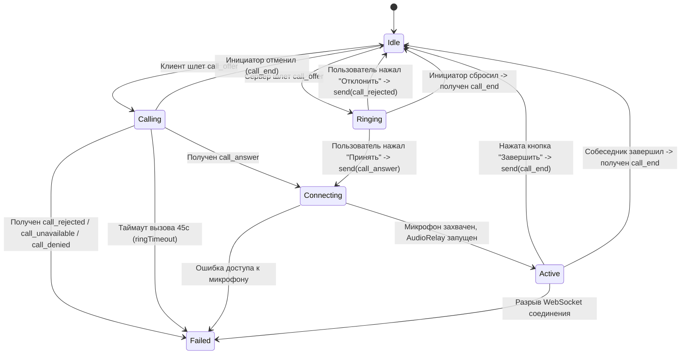
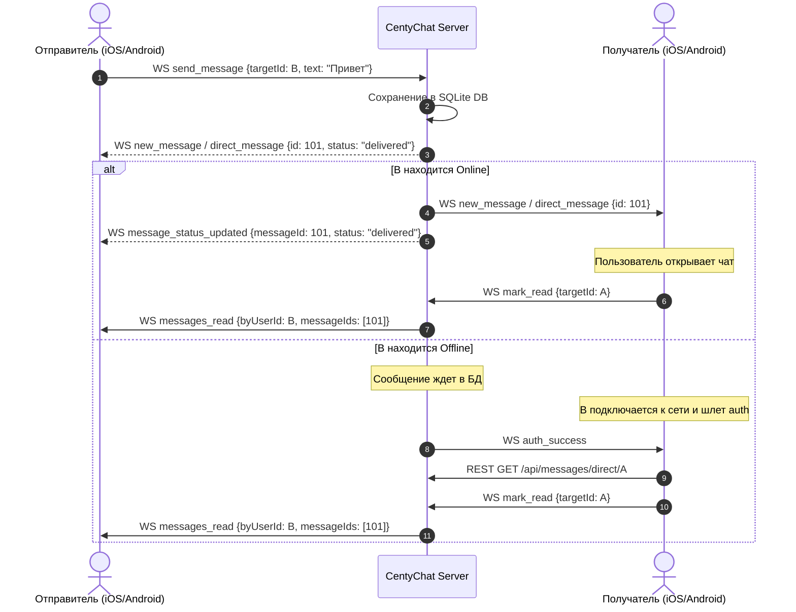

# Протокол WebSocket CentyChat

Спецификация двустороннего обмена сообщениями в реальном времени между мобильными клиентами (iOS / Android) и сервером CentyChat на основе `server/src/ws/server.js`.

---

## 1. Общие сведения и транспортный уровень

- **Транспорт**: WebSocket (RFC 6455) поверх TLS/TCP (WSS / WS).
- **Порт по умолчанию**: `2004` (HTTP/WS) или `443` (HTTPS/WSS в production).
- **Путь подключения**: `/ws`.
- **Кодировка текста**: UTF-8. Все текстовые сообщения представляют собой валидный JSON.
- **Двоичные данные**: Бинарные кадры зарезервированы исключительно для потоковой передачи голоса (Audio Relay).

---

## 2. Установка соединения, хэндшейк и безопасность

### 2.1. Проверки при рукопожатии (`verifyClient`)

До установления WebSocket-соединения сервер выполняет три уровня проверок на фазе HTTP Upgrade:

1. **IP-фильтрация (`isIpAllowed`)**:
   - Если задана переменная окружения `ALLOWED_CLIENT_IPS`, подключения с адресов не из белого списка отклоняются с кодом `403 IP not allowed`.
2. **Проверка Origin (`originAllowed`)**:
   - Для браузеров проверяется совпадение с хостом сервера или `CORS_ALLOWED_ORIGINS`.
   - Для мобильных нативных клиентов заголовок Origin отсутствует либо валидируется как доверенный.
3. **Лимит соединений по IP (`MAX_SOCKETS_PER_IP`)**:
   - Максимум **2000** одновременных сокетов на подсеть `/64` для IPv6 или отдельный IPv4. При превышении отказ с кодом `429 Too many connections`.

### 2.2. Лимиты безопасности соединения

| Параметр | Значение | Описание |
|---|---|---|
| `PRE_AUTH_MAX_BYTES` | **4 096 байт** (4 КБ) | Максимальный размер первого сообщения неавторизованного сокета. До авторизации разрешен только тип `auth`. При превышении сокет немедленно закрывается с кодом `1008`. |
| `WS_AUTH_TIMEOUT_MS` | **10 000 мс** (10 с) | Таймаут ожидания успешной авторизации после подключения. При истечении таймера сокет закрывается с кодом `4001 Authentication timeout`. |
| `MAX_TEXT_FRAME_BYTES` | **262 144 байт** (256 КБ) | Максимальный размер обычного входящего текстового кадра (чат, статусы, тайпинг). |
| `MAX_MESSAGE_BYTES` | **16 777 216 байт** (16 МБ) | Абсолютный потолок библиотеки `ws`. Кадры > 256 КБ допускаются только для активных сессий звонков (`call_*`, `ice_candidate`) или сессий удаленного стола (`rd_*`). |
| `MAX_SOCKETS_PER_USER` | **8 сокетов** | Максимальное число одновременных сокетов для одной учетной записи сотрудника. При превышении — ошибка `TOO_MANY_SESSIONS`. |

### 2.3. Rate Limiting (ограничения частоты сообщений на клиенте)

Сервер ведет скользящие окна запросов (`[лимит, окно_мс]`) индивидуально для каждого сокета:

| Тип сообщения | Лимит | Окно (мс) | Поведение при превышении |
|---|---|---|---|
| `presence`, `set_dnd`, `set_status`, `status_update` | 10 | 1 000 | Игнорирование сообщения |
| `typing` | 6 | 1 000 | Игнорирование сообщения |
| `send_message`, `direct_message`, `channel_message` | 10 | 1 000 | Игнорирование сообщения |
| `edit_message`, `delete_message` | 10 | 1 000 | Игнорирование сообщения |
| `mark_read` | 20 | 1 000 | Игнорирование сообщения |
| `call_offer` | 3 | 10 000 | Игнорирование вызова |
| `wake_send` | 20 | 10 000 | Ответ `wake_error: cooldown` (действует также персональный кулдаун 60 с) |
| `ice_candidate` | 60 | 1 000 | Игнорирование сообщения |
| `audio` (бинарные кадры) | 120 | 1 000 | Сброс аудиокадра |
| Все остальные (`*`) | 60 | 1 000 | Игнорирование сообщения |

### 2.4. Сердечный ритм (Heartbeat / Keepalive)

1. Сервер каждые **30 секунд** отправляет WebSocket-кадр `Ping`.
2. Клиент обязан автоматически или вручную ответить кадром `Pong`.
3. Если сокет не ответил `Pong` к следующей итерации таймера, сервер принудительно разрывает соединение вызовом `ws.terminate()`.

### 2.5. Ревалидация сессий (`revalidateAll`)

Каждые **60 секунд** сервер опрашивает базу данных для всех открытых сокетов. Если:
- Токен пользователя отозван (logout, смена пароля `token_version` инкрементирован),
- Учетная запись заблокирована (`is_active = 0`),
- Изменилась роль пользователя,

сервер отправляет сокету сообщение:
```json
{
  "type": "server_disconnect",
  "reason": "Сессия недействительна — войдите заново"
}
```
и закрывает соединение с кодом `4003 Session revoked`.

---

## 3. Сообщения: Клиент -> Сервер

Каждое текстовое сообщение должно быть JSON-объектом с обязательным строковым полем `type`.

### 3.1. `auth` — Авторизация сокета

Первое сообщение, которое клиент **обязан** отправить сразу после успешного TCP/WS соединения.

```json
{
  "type": "auth",
  "token": "eyJhbGciOiJIUzI1NiIsInR5cCI6IkpXVCJ9..."
}
```

- **Параметры**:
  - `token` *(string, required)*: действующий сессионный JWT токен CentyChat, полученный при входе по паролю (`/api/auth/login`) или «стуке» устройства (`/api/auth/knock`).
- **Ошибки**:
  - `auth_error` (`INVALID_TOKEN`, `MUST_CHANGE_PASSWORD`, `TOO_MANY_SESSIONS`, `RATE_LIMITED`).
- **Успех**:
  - Сервер отвечает `auth_success`, `wake_state`, и рассылает `user_status_changed` всем остальным клиентам.

---

### 3.2. `send_message` — Отправка сообщения в чат

Отправка текстового сообщения, файла или изображения в канал или личный диалог.

```json
{
  "type": "send_message",
  "conversationType": "channel",
  "targetId": 1,
  "text": "Коллеги, доброе утро! Спецификация готова.",
  "msgType": "text",
  "replyToId": 142,
  "metadata": {
    "file_id": 42
  }
}
```

- **Параметры**:
  - `conversationType` *(string, optional)*: `"channel"` или `"direct"`. Если не указано, вычисляется по алиасам: если `channel_id` — `"channel"`, иначе `"direct"`.
  - `targetId` *(number, required)*: числовой ID канала или ID пользователя-собеседника.
  - `text` *(string, required)*: текст сообщения (от 1 до 16 000 символов).
  - `msgType` *(string, optional, default: "text")*: `"text"`, `"file"`, `"image"`.
  - `replyToId` *(number, optional)*: ID сообщения, на которое дается ответ. Сервер валидирует, что исходное сообщение принадлежит этой же беседе.
  - `metadata` *(object, optional)*: объект метаданных (до 4 КБ в сериализованном виде). Для вложений содержит `file_id`. Сервер проверяет право доступа к файлу.
- **Алиасы**: Поддерживаются также типы `direct_message` и `channel_message`, а также поля `recipient_id` и `channel_id`.
- **Ошибки**:
  - При ошибке сервер возвращает клиенту `{ "type": "error", "context": "send_message", "message": "...", "text": "..." }`, возвращая исходный текст для восстановления в UI ввода.

---

### 3.3. `edit_message` — Редактирование сообщения

Редактирование ранее отправленного собственного текстового сообщения.

```json
{
  "type": "edit_message",
  "messageId": 1054,
  "text": "Исправленный текст сообщения"
}
```

- **Ограничения**:
  - Допускается только для автора сообщения.
  - Сообщение не должно быть удалено (`is_deleted = 0`).
  - Тип сообщения должен быть строго `"text"`.
  - Время с момента создания должно укладываться в настройку `message_edit_window_minutes` (-1 = запрещено, 0 = без ограничений, по умолчанию 60 минут).
- **Результат**:
  - Исходная версия архивируется в `message_history`.
  - Всем участникам переписки рассылается событие `message_updated`.

---

### 3.4. `delete_message` — Удаление сообщения

Удаление сообщения (своего или чужого при правах суперадминистратора).

```json
{
  "type": "delete_message",
  "messageId": 1054
}
```

- **Ограничения**:
  - Обычный пользователь может удалять только свои сообщения в пределах `message_delete_window_minutes`.
  - Суперадминистратор может удалять любые сообщения в целях модерации в любое время (с обязательной записью в `audit_logs`).
- **Результат**:
  - Текст и метаданные сообщения обнуляются, `is_deleted` выставляется в `1`. Исходный текст сохраняется в `message_history`.
  - Участникам рассылается событие `message_deleted`.

---

### 3.5. `mark_read` — Отметка о прочтении сообщений

```json
{
  "type": "mark_read",
  "conversationType": "direct",
  "targetId": 7
}
```

- **Параметры**:
  - `conversationType` *(string, required)*: `"channel"` или `"direct"`.
  - `targetId` *(number, required)*: ID канала или ID собеседника.
- **Логика**:
  - Для канала: обновляет `last_read_message_id` в таблице `channel_members`.
  - Для личного диалога: находит все непрочитанные входящие сообщения от `targetId` и проставляет им статус `'read'`. Отправителю уходит WS-уведомление `messages_read`.

---

### 3.6. `typing` — Индикатор набора текста

```json
{
  "type": "typing",
  "conversationType": "channel",
  "targetId": 1,
  "isTyping": true
}
```

- **Параметры**:
  - `conversationType` *(string)*: `"channel"` или `"direct"`.
  - `targetId` *(number)*: ID канала или собеседника.
  - `isTyping` *(boolean)*: `true` — начал печатать, `false` — прекратил.
- **Маршрутизация**:
  - Для каналов: отправляется только текущим членам канала (кроме автора).
  - Для direct: отправляется собеседнику `targetId`.

---

### 3.7. `presence` и `set_dnd` — Управление статусом присутствия

Системный статус присутствия (`online` / `away`) отправляется клиентом при активности / блокировке экрана. Режим «Не беспокоить» (`dnd`) сохраняется между переподключениями сокета.

```json
{
  "type": "presence",
  "state": "away",
  "customStatus": "Обед до 14:00"
}
```

или управление режимом DND:

```json
{
  "type": "set_dnd",
  "enabled": true,
  "customStatus": null
}
```

- **Параметры `presence`**:
  - `state` *(string)*: строго `"online"` или `"away"`. (Значение `"offline"` сервер выставляет только при физическом дисконнекте).
  - `customStatus` *(string, optional, max 200 chars)*: произвольный текст статуса или `null`.
- **Параметры `set_dnd`**:
  - `enabled` *(boolean)*: `true` для включения «Не беспокоить», `false` для отключения.
- **Поддержка легаси**: сервер также принимает типы `set_status` и `status_update` со значением `status: "online" | "away" | "dnd"`.

---

### 3.8. `wake_send` — Побудка («звонок/встряска») собеседника

Функция привлечения внимания коллеги (аналог nudge/buzz).

```json
{
  "type": "wake_send",
  "targetUserId": 12
}
```

- **Правила и ограничения**:
  - Кулдаун: не чаще **1 раза в 60 секунд** от одного отправителя (таймаут общий на все цели, чтобы нельзя было будить весь отдел подряд).
  - Нельзя будить самого себя, неактивного пользователя, пользователя не в сети или пользователя с включенным режимом «Не беспокоить» (`dnd`).
- **Ответы сервера**:
  - Инициатору: `{ "type": "wake_sent", "targetUserId": 12, "at": 1759230000000, "retryAt": 1759230060000 }`
  - Целевому сотруднику: `{ "type": "wake_ring", "fromUserId": 7, "fromName": "Алия Серикова", "at": 1759230000000 }`
  - При ошибке/кулдауне инициатору: `{ "type": "wake_error", "code": "cooldown" | "invalid_target" | "dnd" | "offline", ... }`

---

### 3.9. Сигналинг голосового вызова (Voice Call Signalling)

Протокол сигналинга для звонков 1-на-1 между сотрудниками.

#### `call_offer` — Исходящий вызов
```json
{
  "type": "call_offer",
  "targetUserId": 12
}
```
*Требует право роли `can_call`. Если у вызываемого включен DND или он офлайн — возвращается `call_unavailable`.*

#### `call_answer` — Принятие вызова
```json
{
  "type": "call_answer",
  "targetUserId": 7
}
```
*Принимается только если от `targetUserId` есть активный ожидающий вызов (`pendingOffers`). После этого сервер фиксирует активную пару `activeCalls`.*

#### `call_rejected` — Отклонение вызова
```json
{
  "type": "call_rejected",
  "targetUserId": 7,
  "reason": "Занят на встрече"
}
```

#### `call_end` — Завершение разговора
```json
{
  "type": "call_end",
  "targetUserId": 12,
  "reason": "Разговор завершен"
}
```

#### `ice_candidate` — Передача WebRTC ICE-кандидата (при наличии P2P)
```json
{
  "type": "ice_candidate",
  "targetUserId": 12,
  "candidate": {
    "candidate": "candidate:1 1 UDP 2130706431 192.168.1.50 54321 typ host",
    "sdpMid": "audio",
    "sdpMLineIndex": 0
  }
}
```

---

## 4. Сообщения: Сервер -> Клиент

### 4.1. Авторизация и статус соединения

#### `auth_success` — Успешный вход сокета
```json
{
  "type": "auth_success",
  "user": {
    "id": 7,
    "username": "k.akhmetov",
    "full_name": "Ахметов Канат",
    "status": "online",
    "permissions": {
      "can_call": true,
      "can_upload_files": true,
      "can_create_channels": true
    }
  }
}
```

#### `auth_error` — Ошибка авторизации
```json
{
  "type": "auth_error",
  "code": "INVALID_TOKEN",
  "message": "Недействительный токен авторизации"
}
```
*Коды: `INVALID_TOKEN`, `MUST_CHANGE_PASSWORD`, `TOO_MANY_SESSIONS`, `RATE_LIMITED`.*

#### `wake_state` — Текущее состояние таймера побудки
Отправляется сразу после `auth_success`.
```json
{
  "type": "wake_state",
  "targetUserId": 12,
  "at": 1759230000000,
  "retryAt": 1759230060000
}
```
*Если кулдаун не активен: `{ "type": "wake_state", "retryAt": 0 }`.*

#### `server_disconnect` — Принудительное отключение сервером
```json
{
  "type": "server_disconnect",
  "reason": "Пароль изменён — переподключение"
}
```

---

### 4.2. Чат и сообщения

#### `new_message` / `direct_message` / `channel_message` — Новое сообщение
Сервер одновременно отправляет `new_message` и специфичный тип (`direct_message` или `channel_message`).

```json
{
  "type": "new_message",
  "message": {
    "id": 512,
    "conversation_type": "direct",
    "target_id": 12,
    "sender_id": 7,
    "text": "Отправил обновленные контракты",
    "type": "text",
    "reply_to_id": null,
    "metadata_json": null,
    "created_at": "2026-09-30T09:40:00.000Z",
    "updated_at": null,
    "is_deleted": 0,
    "sender_username": "k.akhmetov",
    "sender_name": "Ахметов Канат",
    "sender_avatar": null,
    "sender_department": "Отдел разработки",
    "file_original_name": null,
    "delivery_status": "delivered"
  }
}
```

#### `message_status_updated` — Отметка о доставке личного сообщения
Отправляется автору сообщения, когда получатель находится онлайн в момент отправки.
```json
{
  "type": "message_status_updated",
  "messageId": 512,
  "status": "delivered",
  "userId": 12,
  "timestamp": "2026-09-30T09:40:01.000Z"
}
```

#### `messages_read` — Собеседник прочитал сообщения
```json
{
  "type": "messages_read",
  "byUserId": 12,
  "messageIds": [510, 511, 512]
}
```

#### `message_updated` — Сообщение отредактировано
```json
{
  "type": "message_updated",
  "message": {
    "id": 512,
    "text": "Отправил обновленные контракты и OpenAPI spec",
    "updated_at": "2026-09-30T09:41:00.000Z"
  }
}
```

#### `message_deleted` — Сообщение удалено
```json
{
  "type": "message_deleted",
  "messageId": 512,
  "conversationType": "direct",
  "targetId": 12
}
```

#### `user_typing` — Собеседник печатает
```json
{
  "type": "user_typing",
  "userId": 12,
  "userName": "Нурпеисов Данияр",
  "conversationType": "channel",
  "targetId": 1,
  "isTyping": true
}
```

---

### 4.3. Присутствие и пользователи

#### `user_status_changed` — Изменение статуса пользователя
Широковещательное оповещение (broadcast) всем подключенным клиентам.
```json
{
  "type": "user_status_changed",
  "userId": 7,
  "user_id": 7,
  "status": "online",
  "customStatus": "Работаю над iOS релизом"
}
```
*Возможные значения `status`: `"online"`, `"away"`, `"dnd"`, `"offline"`.*

#### `user_created` и `user_updated` — Изменения в справочнике
```json
{
  "type": "user_created",
  "user": {
    "id": 25,
    "username": "s.bolat",
    "full_name": "Болат Серик",
    "department_name": "Бухгалтерия",
    "status": "offline"
  }
}
```

---

### 4.4. Корпоративные каналы

#### `channel_created`
Рассылается всем участникам при создании канала (для приватных каналов — строго созданным участникам).
```json
{
  "type": "channel_created",
  "channel": {
    "id": 8,
    "name": "#Мобильные-Приложения",
    "topic": "Координация iOS и Android разработки",
    "type": "public",
    "owner_id": 7,
    "created_at": "2026-09-30T09:45:00.000Z"
  }
}
```

#### `channel_deleted`
```json
{
  "type": "channel_deleted",
  "channelId": 8
}
```

---

### 4.5. Оповещения компании (Announcements)

#### `new_announcement`
Рассылается всем целевым сотрудникам при создании важного оповещения.
```json
{
  "type": "new_announcement",
  "announcement": {
    "id": 4,
    "author_id": 1,
    "title": "Срочное обновление безопасности",
    "content": "Всем сотрудникам установить мобильное приложение CentyChat v1.0.",
    "priority": "critical",
    "target_type": "all",
    "created_at": "2026-09-30T09:50:00.000Z",
    "author_name": "Главный Администратор"
  }
}
```

#### `announcement_acknowledged`
Рассылается автору и получателям при подтверждении ознакомления сотрудником.
```json
{
  "type": "announcement_acknowledged",
  "announcementId": "4",
  "userId": 7,
  "userName": "Ахметов Канат"
}
```

---

### 4.6. Голосовые звонки (Server Relay)

#### `call_offer` — Входящий звонок
```json
{
  "type": "call_offer",
  "targetUserId": 7,
  "senderId": 12,
  "senderName": "Нурпеисов Данияр"
}
```

#### `call_answer` — Ответ на вызов
```json
{
  "type": "call_answer",
  "targetUserId": 12,
  "senderId": 7,
  "senderName": "Ахметов Канат"
}
```

#### `call_rejected` — Вызов отклонен
```json
{
  "type": "call_rejected",
  "targetUserId": 12,
  "senderId": 7,
  "senderName": "Ахметов Канат",
  "reason": "Занят на совещании"
}
```

#### `call_end` — Вызов завершен
```json
{
  "type": "call_end",
  "targetUserId": 12,
  "senderId": 7,
  "senderName": "Ахметов Канат",
  "reason": "connection_lost"
}
```

#### `call_denied` — Звонок запрещен политикой
```json
{
  "type": "call_denied",
  "reason": "Звонки не разрешены для вашей роли. Обратитесь к администратору."
}
```

#### `call_unavailable` — Собеседник недоступен
```json
{
  "type": "call_unavailable",
  "targetUserId": 12,
  "reason": "У сотрудника включено «Не беспокоить»"
}
```

---

## 5. Бинарный протокол передачи звука (Audio Relay)

Поскольку в корпоративных сетях корпоративный UDP часто закрыт брандмауэрами, а STUN/TURN не всегда доступны, в CentyChat встроен **проверенный аудио-релей прямо поверх WebSocket**.

### 5.1. Структура бинарного кадра WebSocket

Длина фрейма фиксирована и составляет **1 028 байт**:

```
 0                   1                   2                   3
 0 1 2 3 4 5 6 7 8 9 0 1 2 3 4 5 6 7 8 9 0 1 2 3 4 5 6 7 8 9 0 1
+-+-+-+-+-+-+-+-+-+-+-+-+-+-+-+-+-+-+-+-+-+-+-+-+-+-+-+-+-+-+-+-+
|                 Target User ID / Sender User ID               | (4 байта, UInt32 BE)
+-+-+-+-+-+-+-+-+-+-+-+-+-+-+-+-+-+-+-+-+-+-+-+-+-+-+-+-+-+-+-+-+
|       PCM Sample 0 (Int16 BE)  |    PCM Sample 1 (Int16 BE)   |
+-+-+-+-+-+-+-+-+-+-+-+-+-+-+-+-+-+-+-+-+-+-+-+-+-+-+-+-+-+-+-+-+
|                              ...                              |
+-+-+-+-+-+-+-+-+-+-+-+-+-+-+-+-+-+-+-+-+-+-+-+-+-+-+-+-+-+-+-+-+
|      PCM Sample 510 (Int16 BE) |   PCM Sample 511 (Int16 BE)  | (1024 байта PCM)
+-+-+-+-+-+-+-+-+-+-+-+-+-+-+-+-+-+-+-+-+-+-+-+-+-+-+-+-+-+-+-+-+
```

1. **Заголовок (Байты 0..3)**:
   - **От клиента к серверу**: `targetUserId` — числовой ID собеседника (UInt32 Big-Endian).
   - **Серверная маршрутизация**: Сервер проверяет, что между отправителем и получателем зафиксирован активный разговор (`activeCalls.get(sender.id) === targetUserId`). Сервер заменяет байты 0..3 на `senderId` (UInt32 Big-Endian) и отправляет кадр получателю.
   - **От сервера к получателю**: Байты 0..3 содержат `senderId` (UInt32 Big-Endian).
2. **Аудиоданные (Байты 4..1027)**:
   - 512 сэмплов по 2 байта (16 бит, signed integer, **Big-Endian**).
   - Значения от `-32768` до `32767`, нормализованные из Float32 `[-1.0, 1.0]`.

### 5.2. Параметры аудиопотока

- **Частота дискретизации (Sample Rate)**: **16 000 Гц** (16 кГц).
- **Каналы**: **1 (моно)**.
- **Размер одного кадра**: **512 сэмплов** = ровно **32 миллисекунды** звука.
- **Частота отправки кадров**: ~31.25 кадров в секунду при активной речи.

### 5.3. Детекция и отсечение тишины (Silence Gating)

Для экономии мобильного трафика и заряда батареи кадры, уровень которых ниже порога тишины, **не отправляются**:
- Расчет средней амплитуды: `avg = sum(abs(sample)) / 512`.
- Порог `SILENCE_THRESHOLD = 0.0015`.
- Если `avg < 0.0015`, кадр отбрасывается.

### 5.4. Джиттер-буфер на приеме (Jitter Scheduling)

Из-за неравномерности мобильной сети воспроизводить входящие кадры мгновенно нельзя. Применяется алгоритм `JitterScheduler`:
- **Целевое опережение (`TARGET_LEAD_SECONDS`)**: **60 мс** (`0.06 с`). Кадр ставится в очередь воспроизведения на `currentTime + 0.06s`.
- **Максимальный буфер (`MAX_LEAD_SECONDS`)**: **250 мс** (`0.25 с`). Если очередь отстает более чем на 250 мс, очередь принудительно сбрасывается к 60 мс (единичный щелчок вместо накапливающейся задержки).

---

## 6. Диаграммы состояний (State Machines)

### 6.1. Жизненный цикл голосового вызова



### 6.2. Жизненный цикл доставки сообщения



### 6.3. Стратегия переподключения (Reconnection Strategy)

При обрыве связи (потеря Wi-Fi / смена сотовой вышки):
1. **Экспоненциальный откат (Exponential Backoff)**:
   - Попытка 1: через 1 секунду.
   - Попытка 2: через 2 секунды.
   - Попытка 3: через 4 секунды.
   - Попытка N: до максимума в 30 секунд с добавлением случайного джиттера ±20%.
2. **Шаги восстановления после реконнекта**:
   - Шаг 1: `ws.connect()`.
   - Шаг 2: отправка `{ type: 'auth', token: currentToken }`.
   - Шаг 3: при получении `auth_error (INVALID_TOKEN)` — запрос свежего токена через REST `POST /api/auth/refresh` или повторный вход.
   - Шаг 4: синхронизация пропущенных сообщений через REST `GET /api/messages?beforeId=...`.
