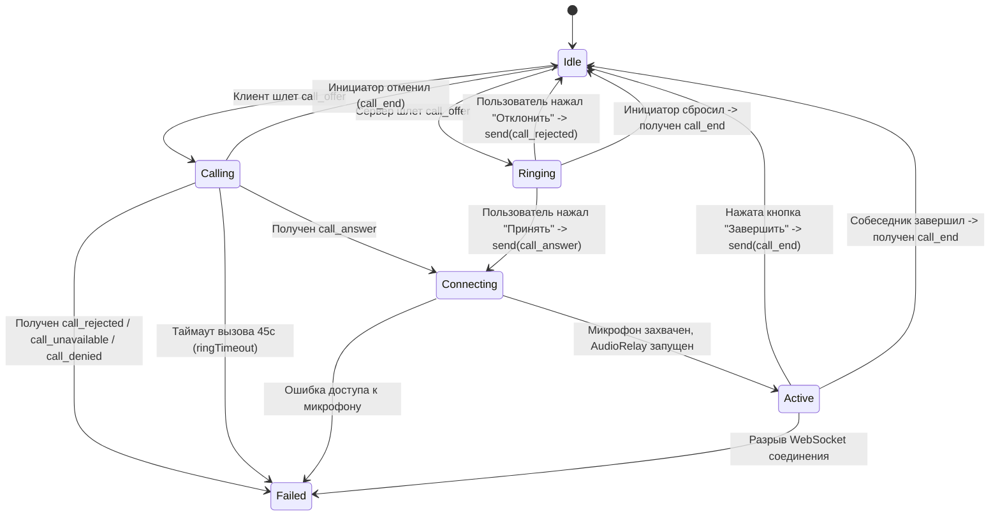

# Протокол WebSocket CentyChat

Спецификация двустороннего обмена сообщениями в реальном времени между мобильными клиентами (iOS / Android) и сервером CentyChat на основе `server/src/ws/server.js`.

---

## 1. Общие сведения и транспортный уровень

- **Транспорт**: WebSocket (RFC 6455) поверх TLS/TCP (WSS / WS).
- **Порт по умолчанию**: `2004` (HTTP/WS) или `443` (HTTPS/WSS в production).
- **Путь подключения**: `/ws`.
- **Кодировка текста**: UTF-8. Все текстовые сообщения представляют собой валидный JSON.
- **Двоичные данные**: Бинарные кадры зарезервированы исключительно для потоковой передачи голоса (Audio Relay).

---

### 1.1. Адрес сервера в мобильных клиентах

Мобильные клиенты **не имеют экрана выбора сервера**. Адрес зашивается при сборке (решение владельца 2026-10-02, задачи 11–12 плана):

- **Release**: константа времени компиляции `https://centychat-production.up.railway.app`; REST — `…/api`, WebSocket — `wss://centychat-production.up.railway.app/ws`. Только HTTPS/WSS, никакого переопределения во время работы.
- **Debug**: адрес берётся из конфигурации сборки (по умолчанию — продакшн). Для локального стенда `mobile/dev` — `https://10.0.2.2:8443` (эмулятор Android) и `https://localhost:8443` (симулятор iOS), WebSocket — `wss://…/ws`.
- Фикстуры и тесты контракта от адреса не зависят.

## 2. Установка соединения, хэндшейк и безопасность

### 2.1. Проверки при рукопожатии (`verifyClient`)

До установления WebSocket-соединения сервер выполняет три уровня проверок на фазе HTTP Upgrade:

1. **IP-фильтрация (`isIpAllowed`)**:
   - Если задана переменная окружения `ALLOWED_CLIENT_IPS`, подключения с адресов не из белого списка отклоняются с кодом `403 IP not allowed`.
2. **Проверка Origin (`originAllowed`)**:
   - Для браузеров проверяется совпадение с хостом сервера или `CORS_ALLOWED_ORIGINS`.
   - Для мобильных нативных клиентов заголовок Origin отсутствует либо валидируется как доверенный.
3. **Лимит соединений по IP (`MAX_SOCKETS_PER_IP`)**:
   - Максимум **2000** одновременных сокетов на подсеть `/64` для IPv6 или отдельный IPv4. При превышении отказ с кодом `429 Too many connections`.

### 2.2. Лимиты безопасности соединения

| Параметр | Значение | Описание |
|---|---|---|
| `PRE_AUTH_MAX_BYTES` | **4 096 байт** (4 КБ) | Максимальный размер первого сообщения неавторизованного сокета. До авторизации разрешен только тип `auth`. При превышении сокет немедленно закрывается с кодом `1008`. |
| `WS_AUTH_TIMEOUT_MS` | **10 000 мс** (10 с) | Таймаут ожидания успешной авторизации после подключения. При истечении таймера сокет закрывается с кодом `4001 Authentication timeout`. |
| `MAX_TEXT_FRAME_BYTES` | **262 144 байт** (256 КБ) | Максимальный размер обычного входящего текстового кадра (чат, статусы, тайпинг). |
| `MAX_MESSAGE_BYTES` | **16 777 216 байт** (16 МБ) | Абсолютный потолок библиотеки `ws`. Кадры > 256 КБ допускаются только для активных сессий звонков (`call_*`, `ice_candidate`) или сессий удаленного стола (`rd_*`). |
| `MAX_SOCKETS_PER_USER` | **8 сокетов** | Максимальное число одновременных сокетов для одной учетной записи сотрудника. При превышении — ошибка `TOO_MANY_SESSIONS`. |

### 2.3. Rate Limiting (ограничения частоты сообщений на клиенте)

Сервер ведет скользящие окна запросов (`[лимит, окно_мс]`) индивидуально для каждого сокета:

| Тип сообщения | Лимит | Окно (мс) | Поведение при превышении |
|---|---|---|---|
| `presence`, `set_dnd`, `set_status`, `status_update` | 10 | 1 000 | Игнорирование сообщения |
| `typing` | 6 | 1 000 | Игнорирование сообщения |
| `send_message`, `direct_message`, `channel_message` | 10 | 1 000 | Игнорирование сообщения |
| `edit_message`, `delete_message` | 10 | 1 000 | Игнорирование сообщения |
| `mark_read` | 20 | 1 000 | Игнорирование сообщения |
| `call_offer` | 3 | 10 000 | Игнорирование вызова |
| `wake_send` | 20 | 10 000 | Ответ `wake_error: cooldown` (действует также персональный кулдаун 60 с) |
| `ice_candidate` | 60 | 1 000 | Игнорирование сообщения |
| `audio` (бинарные кадры) | 120 | 1 000 | Сброс аудиокадра |
| Все остальные (`*`) | 60 | 1 000 | Игнорирование сообщения |

### 2.4. Сердечный ритм (Heartbeat / Keepalive)

1. Сервер каждые **30 секунд** отправляет WebSocket-кадр `Ping`.
2. Клиент обязан автоматически или вручную ответить кадром `Pong`.
3. Если сокет не ответил `Pong` к следующей итерации таймера, сервер принудительно разрывает соединение вызовом `ws.terminate()`.

### 2.5. Ревалидация сессий (`revalidateAll`)

Каждые **60 секунд** сервер опрашивает базу данных для всех открытых сокетов. Если:
- Токен пользователя отозван (logout, смена пароля `token_version` инкрементирован),
- Учетная запись заблокирована (`is_active = 0`),
- Изменилась роль пользователя,

сервер отправляет сокету сообщение:
```json
{
  "type": "server_disconnect",
  "reason": "Сессия недействительна — войдите заново"
}
```
и закрывает соединение с кодом `4003 Session revoked`.

---

## 3. Сообщения: Клиент -> Сервер

Каждое текстовое сообщение должно быть JSON-объектом с обязательным строковым полем `type`.

### 3.1. `auth` — Авторизация сокета

Первое сообщение, которое клиент **обязан** отправить сразу после успешного TCP/WS соединения.

```json
{
  "type": "auth",
  "token": "eyJhbGciOiJIUzI1NiIsInR5cCI6IkpXVCJ9..."
}
```

- **Параметры**:
  - `token` *(string, required)*: действующий сессионный JWT токен CentyChat, полученный при входе по паролю (`/api/auth/login`) или «стуке» устройства (`/api/auth/knock`).
- **Ошибки**:
  - `auth_error` (`INVALID_TOKEN`, `MUST_CHANGE_PASSWORD`, `TOO_MANY_SESSIONS`, `RATE_LIMITED`).
- **Успех**:
  - Сервер отвечает `auth_success`, `wake_state`, и рассылает `user_status_changed` всем остальным клиентам.

---

### 3.2. `send_message` — Отправка сообщения в чат

Отправка текстового сообщения, файла или изображения в канал или личный диалог.

```json
{
  "type": "send_message",
  "conversationType": "channel",
  "targetId": 1,
  "text": "Коллеги, доброе утро! Спецификация готова.",
  "msgType": "text",
  "replyToId": 142,
  "metadata": {
    "file_id": 42
  }
}
```

- **Параметры**:
  - `conversationType` *(string, optional)*: `"channel"` или `"direct"`. Если не указано, вычисляется по алиасам: если `channel_id` — `"channel"`, иначе `"direct"`.
  - `targetId` *(number, required)*: числовой ID канала или ID пользователя-собеседника.
  - `text` *(string, required)*: текст сообщения (от 1 до 16 000 символов).
  - `msgType` *(string, optional, default: "text")*: `"text"`, `"file"`, `"image"`.
  - `replyToId` *(number, optional)*: ID сообщения, на которое дается ответ. Сервер валидирует, что исходное сообщение принадлежит этой же беседе.
  - `metadata` *(object, optional)*: объект метаданных (до 4 КБ в сериализованном виде). Для вложений содержит `file_id`. Сервер проверяет право доступа к файлу.
- **Алиасы**: Поддерживаются также типы `direct_message` и `channel_message`, а также поля `recipient_id` и `channel_id`.
- **Ошибки**:
  - При ошибке сервер возвращает клиенту `{ "type": "error", "context": "send_message", "message": "...", "text": "..." }`, возвращая исходный текст для восстановления в UI ввода.

---

### 3.3. `edit_message` — Редактирование сообщения

Редактирование ранее отправленного собственного текстового сообщения.

```json
{
  "type": "edit_message",
  "messageId": 1054,
  "text": "Исправленный текст сообщения"
}
```

- **Ограничения**:
  - Допускается только для автора сообщения.
  - Сообщение не должно быть удалено (`is_deleted = 0`).
  - Тип сообщения должен быть строго `"text"`.
  - Время с момента создания должно укладываться в настройку `message_edit_window_minutes` (-1 = запрещено, 0 = без ограничений, по умолчанию 60 минут).
- **Результат**:
  - Исходная версия архивируется в `message_history`.
  - Всем участникам переписки рассылается событие `message_updated`.

---

### 3.4. `delete_message` — Удаление сообщения

Удаление сообщения (своего или чужого при правах суперадминистратора).

```json
{
  "type": "delete_message",
  "messageId": 1054
}
```

- **Ограничения**:
  - Обычный пользователь может удалять только свои сообщения в пределах `message_delete_window_minutes`.
  - Суперадминистратор может удалять любые сообщения в целях модерации в любое время (с обязательной записью в `audit_logs`).
- **Результат**:
  - Текст и метаданные сообщения обнуляются, `is_deleted` выставляется в `1`. Исходный текст сохраняется в `message_history`.
  - Участникам рассылается событие `message_deleted`.

---

### 3.5. `mark_read` — Отметка о прочтении сообщений

```json
{
  "type": "mark_read",
  "conversationType": "direct",
  "targetId": 7
}
```

- **Параметры**:
  - `conversationType` *(string, required)*: `"channel"` или `"direct"`.
  - `targetId` *(number, required)*: ID канала или ID собеседника.
- **Логика**:
  - Для канала: обновляет `last_read_message_id` в таблице `channel_members`.
  - Для личного диалога: находит все непрочитанные входящие сообщения от `targetId` и проставляет им статус `'read'`. Отправителю уходит WS-уведомление `messages_read`.

---

### 3.6. `typing` — Индикатор набора текста

```json
{
  "type": "typing",
  "conversationType": "channel",
  "targetId": 1,
  "isTyping": true
}
```

- **Параметры**:
  - `conversationType` *(string)*: `"channel"` или `"direct"`.
  - `targetId` *(number)*: ID канала или собеседника.
  - `isTyping` *(boolean)*: `true` — начал печатать, `false` — прекратил.
- **Маршрутизация**:
  - Для каналов: отправляется только текущим членам канала (кроме автора).
  - Для direct: отправляется собеседнику `targetId`.

---

### 3.7. `presence` и `set_dnd` — Управление статусом присутствия

Системный статус присутствия (`online` / `away`) отправляется клиентом при активности / блокировке экрана. Режим «Не беспокоить» (`dnd`) сохраняется между переподключениями сокета.

```json
{
  "type": "presence",
  "state": "away",
  "customStatus": "Обед до 14:00"
}
```

или управление режимом DND:

```json
{
  "type": "set_dnd",
  "enabled": true,
  "customStatus": null
}
```

- **Параметры `presence`**:
  - `state` *(string)*: строго `"online"` или `"away"`. (Значение `"offline"` сервер выставляет только при физическом дисконнекте).
  - `customStatus` *(string, optional, max 200 chars)*: произвольный текст статуса или `null`.
- **Параметры `set_dnd`**:
  - `enabled` *(boolean)*: `true` для включения «Не беспокоить», `false` для отключения.
- **Поддержка легаси**: сервер также принимает типы `set_status` и `status_update` со значением `status: "online" | "away" | "dnd"`.

---

### 3.8. `wake_send` — Побудка («звонок/встряска») собеседника

Функция привлечения внимания коллеги (аналог nudge/buzz).

```json
{
  "type": "wake_send",
  "targetUserId": 12
}
```

- **Правила и ограничения**:
  - Кулдаун: не чаще **1 раза в 60 секунд** от одного отправителя (таймаут общий на все цели, чтобы нельзя было будить весь отдел подряд).
  - Нельзя будить самого себя, неактивного пользователя, пользователя не в сети или пользователя с включенным режимом «Не беспокоить» (`dnd`).
- **Ответы сервера**:
  - Инициатору: `{ "type": "wake_sent", "targetUserId": 12, "at": 1759230000000, "retryAt": 1759230060000 }`
  - Целевому сотруднику: `{ "type": "wake_ring", "fromUserId": 7, "fromName": "Алия Серикова", "at": 1759230000000 }`
  - При ошибке/кулдауне инициатору: `{ "type": "wake_error", "code": "cooldown" | "invalid_target" | "dnd" | "offline", ... }`

---

### 3.9. Сигналинг голосового вызова (Voice Call Signalling)

Протокол сигналинга для звонков 1-на-1 между сотрудниками.

#### `call_offer` — Исходящий вызов
```json
{
  "type": "call_offer",
  "targetUserId": 12
}
```
*Требует право роли `can_call`. Если у вызываемого включен DND или он офлайн — возвращается `call_unavailable`.*

#### `call_answer` — Принятие вызова
```json
{
  "type": "call_answer",
  "targetUserId": 7
}
```
*Принимается только если от `targetUserId` есть активный ожидающий вызов (`pendingOffers`). После этого сервер фиксирует активную пару `activeCalls`.*

#### `call_rejected` — Отклонение вызова
```json
{
  "type": "call_rejected",
  "targetUserId": 7,
  "reason": "Занят на встрече"
}
```

#### `call_end` — Завершение разговора
```json
{
  "type": "call_end",
  "targetUserId": 12,
  "reason": "Разговор завершен"
}
```

#### `ice_candidate` — Передача WebRTC ICE-кандидата (при наличии P2P)
```json
{
  "type": "ice_candidate",
  "targetUserId": 12,
  "candidate": {
    "candidate": "candidate:1 1 UDP 2130706431 192.168.1.50 54321 typ host",
    "sdpMid": "audio",
    "sdpMLineIndex": 0
  }
}
```

---

## 4. Сообщения: Сервер -> Клиент

Все примеры ниже — **дословные кадры реального сервера** (значения нормализованы: токены, время, UIN). Они же лежат в `mobile/contracts/fixtures/ws/` и декодируются в unit-тестах обеих платформ; соответствие «событие → файл» — в §7. Клиент обязан **игнорировать неизвестные поля** (сервер добавляет поля аддитивно) и **неизвестные `type`**.

Общие правила декодирования:
- Идентификаторы — JSON-числа (`Int64`/`Long`). Исключение: `announcement_acknowledged.announcementId` — **строка** (берётся из URL).
- `is_active`, `is_deleted`, `must_change_password` — числа `0/1`, не boolean.
- Время в сообщениях — ISO-8601 строки UTC (`2026-10-02T09:00:00.000Z`); время в событиях побудки (`at`, `retryAt`) — **epoch в миллисекундах** (число).
- Для личных сообщений `target_id` — id **получателя**, поэтому собеседник = та сторона пары (`sender_id`, `target_id`), которая не вы.

### 4.1. Авторизация и статус соединения

#### `auth_success` — сокет авторизован
Объект `user` — полный профиль сессии (как `user` в `/auth/me`): помимо базовых полей содержит служебные (`permissions_json` — те же права, но строкой; `token_version`, `bound_ip`, `last_login_ip`). Клиент использует `id`, `username`, `full_name`, `permissions`, `status`, остальное игнорирует.
```json
{
  "type": "auth_success",
  "user": {
    "id": 2,
    "username": "alice",
    "full_name": "Алиса Тестова",
    "email": "alice@example.test",
    "phone": "",
    "job_title": "Сотрудник",
    "department_id": null,
    "uin": 1002,
    "extension": "",
    "company": "АО \"Страховая компания \"Сентрас Иншуранс\"",
    "role_id": 2,
    "avatar_url": null,
    "status": "online",
    "custom_status": null,
    "last_seen": "2026-10-02T09:00:01.000Z",
    "is_active": 1,
    "created_at": "2026-10-02T09:00:00.000Z",
    "bound_ip": null,
    "admin_scope_dept_id": null,
    "must_change_password": 0,
    "approval_status": "approved",
    "registered_at": null,
    "token_version": 1,
    "last_login_at": "2026-10-02T09:00:01.000Z",
    "last_login_ip": "127.0.0.1",
    "role_name": "Сотрудник",
    "permissions_json": "{\"is_admin\":false,\"can_manage_users\":false,\"can_manage_structure\":false,\"can_manage_db\":false,\"can_broadcast\":false,\"can_call\":true,\"can_remote_control\":false,\"can_create_channels\":true,\"can_upload_files\":true}",
    "department_name": null,
    "admin_scope_dept_name": null,
    "permissions": {
      "is_admin": false,
      "can_manage_users": false,
      "can_manage_structure": false,
      "can_manage_db": false,
      "can_broadcast": false,
      "can_call": true,
      "can_remote_control": false,
      "can_create_channels": true,
      "can_upload_files": true
    }
  }
}
```
Порядок после успешного `auth`: `auth_success` → `wake_state` → широковещательный `user_status_changed` (приходит и самому вошедшему).

#### `auth_error` — ошибка авторизации сокета
Сервер сокет **не закрывает** (кроме тайм-аута 4001), клиент сам решает, что делать. `code` — машинное поле, `message` — для показа.

| `code` | Когда | Действие клиента |
|---|---|---|
| `INVALID_TOKEN` | токен подделан, истёк, отозван (logout, смена пароля/роли, отключение учётной записи) | остановить автопереподключение; получить новый токен (см. §6.3): `/auth/knock` с секретом устройства или экран входа |
| `MUST_CHANGE_PASSWORD` | `must_change_password = 1` | показать экран смены пароля, сокет не открывать |
| `TOO_MANY_SESSIONS` | уже 8 сокетов у пользователя | повторить позже с backoff |
| `RATE_LIMITED` | 10 неудачных `auth` за минуту с адреса | backoff не менее 60 с |

```json
{
  "type": "auth_error",
  "code": "INVALID_TOKEN",
  "message": "Недействительный токен авторизации"
}
```
```json
{
  "type": "auth_error",
  "message": "Требуется смена пароля перед продолжением работы",
  "code": "MUST_CHANGE_PASSWORD"
}
```
```json
{
  "type": "auth_error",
  "code": "TOO_MANY_SESSIONS",
  "message": "Слишком много открытых окон. Закройте лишние."
}
```
```json
{
  "type": "auth_error",
  "code": "RATE_LIMITED",
  "message": "Слишком много попыток. Повторите через минуту."
}
```

#### `wake_state` — состояние паузы побудки
Приходит сразу после `auth_success`. `retryAt` — epoch мс; `0` — пауза не активна (полей `targetUserId`/`at` тогда нет).
```json
{
  "type": "wake_state",
  "retryAt": 0
}
```
```json
{
  "type": "wake_state",
  "targetUserId": 3,
  "at": 1790931600000,
  "retryAt": 1790931660000
}
```

#### `server_disconnect` — принудительное отключение
Сразу после кадра сервер закрывает сокет с кодом `4003`. **Переподключаться тем же токеном нельзя.**
Причины (`reason`, строка для показа): `Выход из системы`, `Пароль изменён — переподключение`, `Сессия недействительна — войдите заново`, `Права учётной записи изменены — войдите заново`, `Права вашей роли изменены администратором — войдите заново`, `Учётная запись отключена администратором`, `Пароль сброшен администратором — войдите заново`, `Сессия принудительно завершена администратором через панель управления`.
```json
{
  "type": "server_disconnect",
  "reason": "Выход из системы"
}
```
```json
{
  "type": "server_disconnect",
  "reason": "Права вашей роли изменены администратором — войдите заново"
}
```

---

### 4.2. Чат и сообщения

#### `new_message` + `direct_message` / `channel_message` — новое сообщение (ВСЕГДА ДВА КАДРА)
Для **каждого** нового сообщения сервер шлёт каждому получателю **два кадра с идентичным `message`**:
1. специфичный: `direct_message` (личное) или `channel_message` (канал);
2. сразу за ним — `new_message`.

Получатели: для личного — собеседник **и сам отправитель** (эхо на все его сокеты); для канала — все участники, включая отправителя. Верно и для WS-отправки (`send_message`), и для REST (`POST /api/messages/direct|channels/{id}`).

**Правило для клиентов:** считать оба кадра одним событием и **дедуплицировать по `message.id`**. Нельзя увеличивать счётчик непрочитанного по каждому кадру отдельно. Допустимые стратегии: слушать только `new_message` и игнорировать специфичные типы; либо обрабатывать оба при обязательной дедупликации по id.

В живых кадрах в `message` **нет** `delivery_status` (он есть только в `GET /api/messages/direct/{id}`). Для отправителя «доставлено» приходит отдельным `message_status_updated`.

Личное сообщение — оба кадра:
```json
{
  "type": "direct_message",
  "message": {
    "id": 8,
    "conversation_type": "direct",
    "target_id": 3,
    "sender_id": 2,
    "text": "Привет, Боб! Договор готов к подписанию.",
    "type": "text",
    "reply_to_id": null,
    "metadata_json": null,
    "created_at": "2026-10-02T09:00:00.000Z",
    "updated_at": null,
    "is_deleted": 0,
    "sender_username": "alice",
    "sender_name": "Алиса Тестова",
    "sender_avatar": null,
    "sender_department": null,
    "file_original_name": null
  }
}
```
```json
{
  "type": "new_message",
  "message": {
    "id": 8,
    "conversation_type": "direct",
    "target_id": 3,
    "sender_id": 2,
    "text": "Привет, Боб! Договор готов к подписанию.",
    "type": "text",
    "reply_to_id": null,
    "metadata_json": null,
    "created_at": "2026-10-02T09:00:00.000Z",
    "updated_at": null,
    "is_deleted": 0,
    "sender_username": "alice",
    "sender_name": "Алиса Тестова",
    "sender_avatar": null,
    "sender_department": null,
    "file_original_name": null
  }
}
```
Сообщение канала — оба кадра:
```json
{
  "type": "channel_message",
  "message": {
    "id": 9,
    "conversation_type": "channel",
    "target_id": 3,
    "sender_id": 2,
    "text": "Релиз мобильных клиентов — в пятницу.",
    "type": "text",
    "reply_to_id": null,
    "metadata_json": null,
    "created_at": "2026-10-02T09:00:00.000Z",
    "updated_at": null,
    "is_deleted": 0,
    "sender_username": "alice",
    "sender_name": "Алиса Тестова",
    "sender_avatar": null,
    "sender_department": null,
    "file_original_name": null
  }
}
```
```json
{
  "type": "new_message",
  "message": {
    "id": 9,
    "conversation_type": "channel",
    "target_id": 3,
    "sender_id": 2,
    "text": "Релиз мобильных клиентов — в пятницу.",
    "type": "text",
    "reply_to_id": null,
    "metadata_json": null,
    "created_at": "2026-10-02T09:00:00.000Z",
    "updated_at": null,
    "is_deleted": 0,
    "sender_username": "alice",
    "sender_name": "Алиса Тестова",
    "sender_avatar": null,
    "sender_department": null,
    "file_original_name": null
  }
}
```
`metadata_json` — **строка** с JSON (или `null`), для вложений `{"file_id":1}`; `file_original_name` — имя файла для скачивания (брать только оттуда, не из `text`). `type`: `text` | `file` | `image`.

#### `message_status_updated` — личное сообщение доставлено
Только автору (всем его сокетам) и **только если получатель был онлайн в момент отправки**. Если получатель подключился позже, статус «доставлено» сервер **не ставит** (см. §6.2).
```json
{
  "type": "message_status_updated",
  "messageId": 8,
  "status": "delivered",
  "userId": 3,
  "timestamp": "2026-10-02T09:00:00.000Z"
}
```

#### `messages_read` — собеседник прочитал сообщения
Только для личных диалогов; уходит автору сообщений. `messageIds` — только вновь прочитанные. Для каналов события нет.
```json
{
  "type": "messages_read",
  "byUserId": 3,
  "messageIds": [
    1,
    3,
    7,
    8
  ]
}
```

#### `message_updated` — сообщение отредактировано
Содержит **полную** запись сообщения (как `new_message`), `updated_at` не `null`. Получатели те же, что у исходного сообщения.
```json
{
  "type": "message_updated",
  "message": {
    "id": 8,
    "conversation_type": "direct",
    "target_id": 3,
    "sender_id": 2,
    "text": "Привет, Боб! Договор готов, жду подпись до 17:00.",
    "type": "text",
    "reply_to_id": null,
    "metadata_json": null,
    "created_at": "2026-10-02T09:00:00.000Z",
    "updated_at": "2026-10-02T09:00:01.000Z",
    "is_deleted": 0,
    "sender_username": "alice",
    "sender_name": "Алиса Тестова",
    "sender_avatar": null,
    "sender_department": null,
    "file_original_name": null
  }
}
```

#### `message_deleted` — сообщение удалено
Записи сообщения в кадре нет: клиент находит его по `messageId` и помечает удалённым (`is_deleted = 1`, пустой `text`).
```json
{
  "type": "message_deleted",
  "messageId": 8,
  "conversationType": "direct",
  "targetId": 3
}
```
```json
{
  "type": "message_deleted",
  "messageId": 9,
  "conversationType": "channel",
  "targetId": 3
}
```

#### `user_typing` — собеседник печатает
`userId` — кто печатает. Для **личных** диалогов `targetId` равен id получателя кадра (то есть вашему), поэтому диалог определяется по `userId`; для **каналов** `targetId` — id канала. Автосброса на сервере нет: индикатор гасится по `isTyping:false` либо клиентом через 3–5 с.
```json
{
  "type": "user_typing",
  "userId": 3,
  "userName": "Боб Тестов",
  "conversationType": "direct",
  "targetId": 2,
  "isTyping": true
}
```
```json
{
  "type": "user_typing",
  "userId": 3,
  "userName": "Боб Тестов",
  "conversationType": "channel",
  "targetId": 3,
  "isTyping": false
}
```

#### `error` — отказ на запрос клиента
Приходит только отправителю запроса. Для `send_message` сервер возвращает исходный `text`, чтобы восстановить поле ввода (композер уже очищен).
```json
{
  "type": "error",
  "context": "send_message",
  "message": "Получатель не найден",
  "text": "Это сообщение не будет доставлено"
}
```
```json
{
  "type": "error",
  "context": "edit_message",
  "message": "Нельзя редактировать чужое сообщение"
}
```
Значения `context`: `send_message`, `edit_message`, `delete_message`; при внутренней ошибке обработки `context` отсутствует (`{"type":"error","message":"Ошибка обработки запроса"}`). `message` — русский текст для показа; машинного кода у `error` нет.

---

### 4.3. Присутствие и пользователи

#### `user_status_changed` — изменение статуса
Широковещательно всем авторизованным сокетам (в том числе инициатору). Всегда оба поля `userId` и `user_id`. `status`: `online` | `away` | `dnd` | `offline`; `customStatus` — строка или `null`. В кадре `offline` (закрыт последний сокет пользователя) поля `customStatus` **нет**.
```json
{
  "type": "user_status_changed",
  "userId": 2,
  "user_id": 2,
  "status": "online",
  "customStatus": null
}
```
```json
{
  "type": "user_status_changed",
  "userId": 2,
  "user_id": 2,
  "status": "away",
  "customStatus": "Обед до 14:00"
}
```
```json
{
  "type": "user_status_changed",
  "userId": 3,
  "user_id": 3,
  "status": "dnd",
  "customStatus": null
}
```

#### `user_created` и `user_updated` — изменения справочника
Рассылаются всем; `user` — публичный профиль (как в `GET /api/users`).
```json
{
  "type": "user_created",
  "user": {
    "id": 4,
    "username": "carol",
    "full_name": "Карина Тестова",
    "email": "carol@example.test",
    "phone": "",
    "job_title": "Сотрудник",
    "department_id": null,
    "uin": 1004,
    "extension": "",
    "company": "АО \"Страховая компания \"Сентрас Иншуранс\"",
    "role_id": 2,
    "avatar_url": null,
    "status": "offline",
    "custom_status": null,
    "last_seen": null,
    "is_active": 1,
    "created_at": "2026-10-02T09:00:00.000Z",
    "department_name": null,
    "role_name": "Сотрудник"
  }
}
```
```json
{
  "type": "user_updated",
  "user": {
    "id": 4,
    "username": "carol",
    "full_name": "Карина Тестова",
    "email": "carol@example.test",
    "phone": "",
    "job_title": "Аналитик",
    "department_id": null,
    "uin": 1004,
    "extension": "",
    "company": "АО \"Страховая компания \"Сентрас Иншуранс\"",
    "role_id": 2,
    "avatar_url": null,
    "status": "offline",
    "custom_status": null,
    "last_seen": null,
    "is_active": 1,
    "created_at": "2026-10-02T09:00:00.000Z",
    "department_name": null,
    "role_name": "Сотрудник"
  }
}
```

---

### 4.4. Корпоративные каналы

#### `channel_created`
Публичные каналы — всем; приватные — только участникам. Запись канала **без** счётчиков (`members_count`, `unread_count`…) — за ними нужен `GET /api/channels`.
```json
{
  "type": "channel_created",
  "channel": {
    "id": 4,
    "name": "#релиз",
    "topic": "Подготовка релиза",
    "type": "public",
    "owner_id": 1,
    "created_at": "2026-10-02T09:00:00.000Z"
  }
}
```

#### `channel_deleted`
```json
{
  "type": "channel_deleted",
  "channelId": 4
}
```

---

### 4.5. Оповещения компании (Announcements)

#### `new_announcement`
При `target_type = all` — всем; иначе адресатам и автору. В кадре **нет** `read_at`, `confirmed_at`, `is_confirmed` (они есть в `GET /api/announcements`): для нового оповещения считать «не подтверждено». `priority`: `normal` | `urgent` | `critical`. `target_ids_json` — строка с JSON-массивом.
```json
{
  "type": "new_announcement",
  "announcement": {
    "id": 2,
    "author_id": 1,
    "title": "Плановое обновление",
    "content": "Сегодня в 22:00 сервер будет недоступен 10 минут.",
    "target_type": "all",
    "target_ids_json": "[]",
    "priority": "urgent",
    "expires_at": null,
    "created_at": "2026-10-02T09:00:00.000Z",
    "author_name": "Администратор системы",
    "author_job_title": "Главный системный администратор"
  }
}
```

#### `announcement_acknowledged`
Автору и адресатам. `announcementId` — **строка**.
```json
{
  "type": "announcement_acknowledged",
  "announcementId": "2",
  "userId": 2,
  "userName": "Алиса Тестова"
}
```

---

### 4.6. Побудка (Wake)

`wake_state` описан в §4.1. Пауза — 60 с на отправителя (не на пару). Отказы `dnd`, `offline`, `invalid_target` паузу **не** запускают.

#### `wake_sent` — инициатору: побудка ушла
```json
{
  "type": "wake_sent",
  "targetUserId": 3,
  "at": 1790931600000,
  "retryAt": 1790931660000
}
```
#### `wake_ring` — адресату: его будят
```json
{
  "type": "wake_ring",
  "fromUserId": 2,
  "fromName": "Алиса Тестова",
  "at": 1790931600000
}
```
#### `wake_error` — отказ
`code`: `cooldown` (есть `retryAt`) | `invalid_target` | `dnd` | `offline`. `message` — русский текст для показа.
```json
{
  "type": "wake_error",
  "code": "cooldown",
  "targetUserId": 3,
  "retryAt": 1790931660000,
  "message": "Будить можно не чаще раза в минуту"
}
```
```json
{
  "type": "wake_error",
  "code": "dnd",
  "targetUserId": 3,
  "message": "У собеседника включено «Не беспокоить»"
}
```
```json
{
  "type": "wake_error",
  "code": "offline",
  "targetUserId": 1,
  "message": "Собеседник не в сети"
}
```
```json
{
  "type": "wake_error",
  "code": "invalid_target",
  "targetUserId": 2,
  "message": "Разбудить можно только коллегу"
}
```

---

### 4.7. Голосовые звонки (Server Relay)

Сигнальные кадры `call_offer`, `call_answer`, `call_rejected`, `call_end`, `ice_candidate` сервер **ретранслирует как есть**: берётся кадр отправителя целиком (включая необязательные `reason`, `candidate`), в нём `targetUserId` — **получатель кадра (вы)**, а `senderId`/`senderName` — собеседник. Собеседника клиент всегда определяет по `senderId`.

```json
{
  "type": "call_offer",
  "targetUserId": 3,
  "senderId": 2,
  "senderName": "Алиса Тестова"
}
```
```json
{
  "type": "ice_candidate",
  "targetUserId": 2,
  "candidate": {
    "candidate": "candidate:1 1 UDP 2130706431 192.168.1.50 54321 typ host",
    "sdpMid": "audio",
    "sdpMLineIndex": 0
  },
  "senderId": 3,
  "senderName": "Боб Тестов"
}
```
```json
{
  "type": "call_answer",
  "targetUserId": 2,
  "senderId": 3,
  "senderName": "Боб Тестов"
}
```
```json
{
  "type": "call_rejected",
  "targetUserId": 2,
  "reason": "Занят на совещании",
  "senderId": 3,
  "senderName": "Боб Тестов"
}
```
```json
{
  "type": "call_end",
  "targetUserId": 3,
  "reason": "Разговор завершен",
  "senderId": 2,
  "senderName": "Алиса Тестова"
}
```
Если собеседник пропал (закрыт его последний сокет), сервер сам шлёт `call_end` **без `targetUserId`** и с `reason = "connection_lost"`; то же — если пропал тот, кто звонил (или кому звонили) и вызов ещё не принят:
```json
{
  "type": "call_end",
  "senderId": 3,
  "senderName": "Боб Тестов",
  "reason": "connection_lost"
}
```
Кадры, которые сервер формирует сам (инициатору вызова):
```json
{
  "type": "call_denied",
  "reason": "Звонки не разрешены для вашей роли. Обратитесь к администратору."
}
```
```json
{
  "type": "call_unavailable",
  "targetUserId": 3,
  "reason": "У сотрудника включено «Не беспокоить»"
}
```
```json
{
  "type": "call_unavailable",
  "targetUserId": 1,
  "reason": "Сотрудник сейчас не в сети"
}
```
`call_unavailable.reason` — «У сотрудника включено «Не беспокоить»» или «Сотрудник сейчас не в сети». `call_answer` без реально ожидающего вызова сервер молча игнорирует; ожидающий вызов живёт 2 минуты.

---

## 5. Бинарный протокол передачи звука (Audio Relay)

Поскольку в корпоративных сетях корпоративный UDP часто закрыт брандмауэрами, а STUN/TURN не всегда доступны, в CentyChat встроен **проверенный аудио-релей прямо поверх WebSocket**.

### 5.1. Структура бинарного кадра WebSocket

Длина фрейма фиксирована и составляет **1 028 байт**:

```
 0                   1                   2                   3
 0 1 2 3 4 5 6 7 8 9 0 1 2 3 4 5 6 7 8 9 0 1 2 3 4 5 6 7 8 9 0 1
+-+-+-+-+-+-+-+-+-+-+-+-+-+-+-+-+-+-+-+-+-+-+-+-+-+-+-+-+-+-+-+-+
|                 Target User ID / Sender User ID               | (4 байта, UInt32 BE)
+-+-+-+-+-+-+-+-+-+-+-+-+-+-+-+-+-+-+-+-+-+-+-+-+-+-+-+-+-+-+-+-+
|       PCM Sample 0 (Int16 BE)  |    PCM Sample 1 (Int16 BE)   |
+-+-+-+-+-+-+-+-+-+-+-+-+-+-+-+-+-+-+-+-+-+-+-+-+-+-+-+-+-+-+-+-+
|                              ...                              |
+-+-+-+-+-+-+-+-+-+-+-+-+-+-+-+-+-+-+-+-+-+-+-+-+-+-+-+-+-+-+-+-+
|      PCM Sample 510 (Int16 BE) |   PCM Sample 511 (Int16 BE)  | (1024 байта PCM)
+-+-+-+-+-+-+-+-+-+-+-+-+-+-+-+-+-+-+-+-+-+-+-+-+-+-+-+-+-+-+-+-+
```

1. **Заголовок (Байты 0..3)**:
   - **От клиента к серверу**: `targetUserId` — числовой ID собеседника (UInt32 Big-Endian).
   - **Серверная маршрутизация**: Сервер проверяет, что между отправителем и получателем зафиксирован активный разговор (`activeCalls.get(sender.id) === targetUserId`). Сервер заменяет байты 0..3 на `senderId` (UInt32 Big-Endian) и отправляет кадр получателю.
   - **От сервера к получателю**: Байты 0..3 содержат `senderId` (UInt32 Big-Endian).
2. **Аудиоданные (Байты 4..1027)**:
   - 512 сэмплов по 2 байта (16 бит, signed integer, **Big-Endian**).
   - Значения от `-32768` до `32767`, нормализованные из Float32 `[-1.0, 1.0]`.

### 5.2. Параметры аудиопотока

- **Частота дискретизации (Sample Rate)**: **16 000 Гц** (16 кГц).
- **Каналы**: **1 (моно)**.
- **Размер одного кадра**: **512 сэмплов** = ровно **32 миллисекунды** звука.
- **Частота отправки кадров**: ~31.25 кадров в секунду при активной речи.

### 5.3. Детекция и отсечение тишины (Silence Gating)

Для экономии мобильного трафика и заряда батареи кадры, уровень которых ниже порога тишины, **не отправляются**:
- Расчет средней амплитуды: `avg = sum(abs(sample)) / 512`.
- Порог `SILENCE_THRESHOLD = 0.0015`.
- Если `avg < 0.0015`, кадр отбрасывается.

### 5.4. Джиттер-буфер на приеме (Jitter Scheduling)

Из-за неравномерности мобильной сети воспроизводить входящие кадры мгновенно нельзя. Применяется алгоритм `JitterScheduler`:
- **Целевое опережение (`TARGET_LEAD_SECONDS`)**: **60 мс** (`0.06 с`). Кадр ставится в очередь воспроизведения на `currentTime + 0.06s`.
- **Максимальный буфер (`MAX_LEAD_SECONDS`)**: **250 мс** (`0.25 с`). Если очередь отстает более чем на 250 мс, очередь принудительно сбрасывается к 60 мс (единичный щелчок вместо накапливающейся задержки).

---

## 6. Диаграммы состояний (State Machines)

### 6.1. Жизненный цикл голосового вызова



### 6.2. Жизненный цикл доставки сообщения

```mermaid
sequenceDiagram
    autonumber
    actor A as Отправитель (iOS/Android)
    participant S as CentyChat Server
    actor B as Получатель (iOS/Android)

    A->>S: WS send_message {targetId: B, text: "Привет"}
    S->>S: Сохранение в БД (идемпотентности нет: client_msg_id не поддерживается)
    S-->>A: WS direct_message + new_message {message.id: 101} (эхо автору)
    S-->>B: WS direct_message + new_message {message.id: 101} (если B онлайн)
    alt B онлайн в момент отправки
        S-->>A: WS message_status_updated {messageId: 101, status: "delivered"}
        Note over B: Пользователь открывает чат
        B->>S: WS mark_read {conversationType: "direct", targetId: A}
        S-->>A: WS messages_read {byUserId: B, messageIds: [101]}
    else B офлайн
        Note over S: Сообщение ждёт в БД; «доставлено» НЕ ставится ни сейчас, ни при подключении B
        Note over B: B подключается, шлёт auth, получает auth_success
        B->>S: REST GET /api/conversations/direct и /api/messages/direct/A
        B->>S: WS mark_read
        S-->>A: WS messages_read {byUserId: B, messageIds: [101]}
    end
```

Следствия для клиентов:
- Автор получает собственное сообщение обратно двумя кадрами (`direct_message` и `new_message`) — это и есть подтверждение сохранения; временную локальную запись нужно заменить записью сервера. Привязки «локальный id → серверный id» нет, сопоставлять приходится по тексту/времени/автору, пока сервер не получит `client_msg_id`.
- При ошибке сервер отвечает `error` с `context: "send_message"` и возвращает `text`. При обрыве соединения до ответа исход **неизвестен**: перед повторной отправкой запросить последнюю страницу переписки и убедиться, что сообщения там нет.

### 6.3. Стратегия переподключения (Reconnection Strategy)

При обрыве связи (потеря Wi-Fi / смена сотовой вышки):
1. **Экспоненциальный откат (Exponential Backoff)**:
   - Попытка 1: через 1 секунду.
   - Попытка 2: через 2 секунды.
   - Попытка 3: через 4 секунды.
   - Попытка N: до максимума в 30 секунд с добавлением случайного джиттера ±20%.
   - При `auth_error` с `RATE_LIMITED` — не менее 60 секунд; при `TOO_MANY_SESSIONS` — медленный откат.
2. **Шаги восстановления после реконнекта**:
   - Шаг 1: открыть `wss://<сервер>/ws`.
   - Шаг 2: отправить `{ "type": "auth", "token": currentToken }`.
   - Шаг 3: при `auth_error` (`INVALID_TOKEN`), `server_disconnect` или HTTP `401` токен **мёртв — автопереподключение остановить**. **Истёкший или отозванный токен продлить нельзя**: `POST /api/auth/refresh` принимает только ещё действующий токен (иначе `401 «Войдите заново»` / `«Недействительный или истекший токен»`), а успешное продление сразу отзывает старый токен. Новый токен можно получить только так:
     - есть секрет устройства: `POST /api/auth/knock` с `device_id` и `device_secret` → `status: "paired"` (новый `token`); `login_required` — секрет недействителен (истёк, сменён пароль), нужен экран входа; `pending` — устройство ждёт привязки администратором;
     - иначе — вход по паролю `POST /api/auth/login`.
     После нового токена — снова шаг 2. Повторять `refresh` с мёртвым токеном нельзя.
   - Шаг 4: **догрузка пропущенного.** Серверной дельта-синхронизации пока нет (нет `afterId`/`updatedSince`; параметр `beforeId` листает только **назад**, к более старым сообщениям, и пропущенное им не получить). После успешного `auth_success`:
     - перезапросить `GET /api/conversations/direct` и `GET /api/channels` (актуальные `unread_count`, последние сообщения);
     - для открытого диалога перезапросить последнюю страницу `GET /api/messages/direct/{id}` или `/api/messages/channels/{id}` (`?limit=50`, максимум 200) и слить с локальной историей **по `id`**;
     - если пробел длиннее страницы — листать `beforeId` от самого нового к последнему известному `id`;
     - пропущенные правки и удаления видны в слитых данных (`updated_at`, `is_deleted = 1`, пустой `text`); пропущенные `messages_read`/`message_status_updated` восстанавливаются только полем `delivery_status` страницы личного диалога (`null` | `delivered` | `read`).
   - Шаг 5: показать индикатор соединения до завершения шага 4.
3. **Проактивное продление**: пока токен действует, за 30 минут до `exp` вызывать `POST /api/auth/refresh`; открытый сокет сервер переводит на новый токен сам.


---

## 7. Фикстуры и соответствие «событие → файл»

Каждый кадр из §4 лежит в `mobile/contracts/fixtures/ws/<событие>[.<вариант>].json` (дословно как на проводе, без обёртки). Ответы HTTP — в `mobile/contracts/fixtures/http/`. Описание способа получения каждого файла — `fixtures/manifest.json`; правила именования и обновления — `fixtures/README.md`. Фикстуры снимает с настоящего сервера `mobile/dev/capture-fixtures.mjs`, дрейф ловит серверный тест `server/test/mobile-contract-fixtures.test.js`.

| Событие | Файлы |
|---|---|
| `auth_success` | `ws/auth_success.json` |
| `auth_error` | `ws/auth_error.invalid_token.json`, `.must_change_password.json`, `.too_many_sessions.json`, `.rate_limited.json` |
| `server_disconnect` | `ws/server_disconnect.logout.json`, `.role-changed.json` |
| `new_message` | `ws/new_message.direct.json`, `ws/new_message.channel.json` |
| `direct_message` / `channel_message` | `ws/direct_message.json`, `ws/channel_message.json` |
| `message_status_updated` | `ws/message_status_updated.json` |
| `messages_read` | `ws/messages_read.json` |
| `message_updated` | `ws/message_updated.json` |
| `message_deleted` | `ws/message_deleted.direct.json`, `.channel.json` |
| `user_typing` | `ws/user_typing.direct.json`, `.channel.json` |
| `user_status_changed` | `ws/user_status_changed.online.json`, `.away.json`, `.dnd.json` |
| `user_created` / `user_updated` | `ws/user_created.json`, `ws/user_updated.json` |
| `channel_created` / `channel_deleted` | `ws/channel_created.json`, `ws/channel_deleted.json` |
| `new_announcement` / `announcement_acknowledged` | `ws/new_announcement.json`, `ws/announcement_acknowledged.json` |
| `call_offer` / `call_answer` / `call_rejected` / `ice_candidate` | `ws/call_offer.json`, `ws/call_answer.json`, `ws/call_rejected.json`, `ws/ice_candidate.json` |
| `call_end` | `ws/call_end.json`, `ws/call_end.connection_lost.json` |
| `call_denied` / `call_unavailable` | `ws/call_denied.json`, `ws/call_unavailable.dnd.json`, `.offline.json` |
| `wake_state` | `ws/wake_state.idle.json`, `.cooldown.json` |
| `wake_sent` / `wake_ring` / `wake_error` | `ws/wake_sent.json`, `ws/wake_ring.json`, `ws/wake_error.cooldown.json`, `.dnd.json`, `.offline.json`, `.invalid_target.json` |
| `error` | `ws/error.send_message.json`, `ws/error.edit_message.json` |
